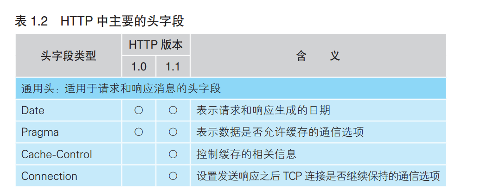
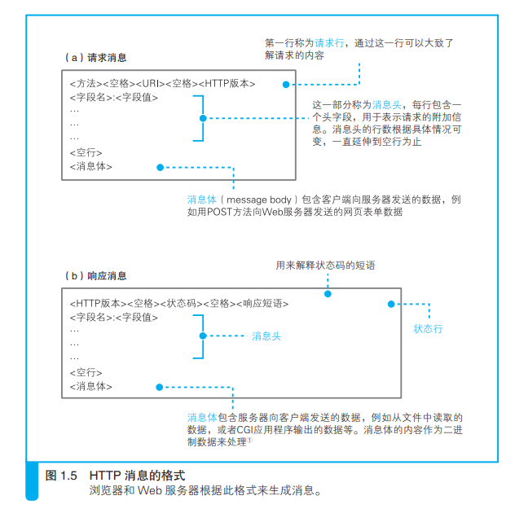
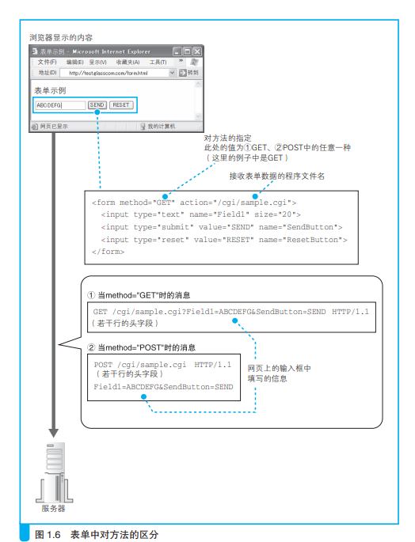

### 生成HTTP请求消息

#### http消息按照一定规定生成

- 首先是请求行，请求行的开头是方法，表示服务器处理请求的方式；
 

- 然后是空格加URI，URI一般为URL中给出的文件地址，URI格式如下：
*/< 目录名 >/…/< 文件名 >*
 

- 请求行的最后要加上http的版本号，表示消息基于哪种http规格编写。
 

- 在请求行中包含了请求的大部分信息，更多的额外信息放在第二行的消息头中，比如时间，日期，数据类型等细节信息。

 

- 完成消息头后，加上一行空格，下面补充消息体。消息体是消息的主体，消息体中存放着要发送给服务器的数据。如果是get方法则只需要方法，URI就可以让服务器进行处理而无需消息体。

---

---
