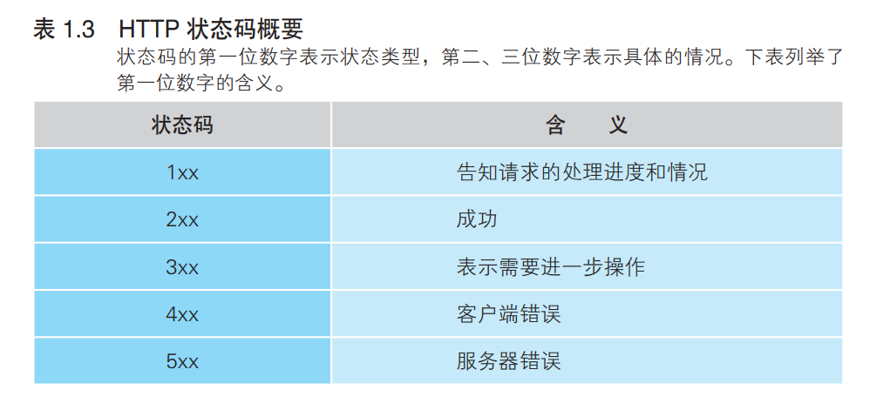
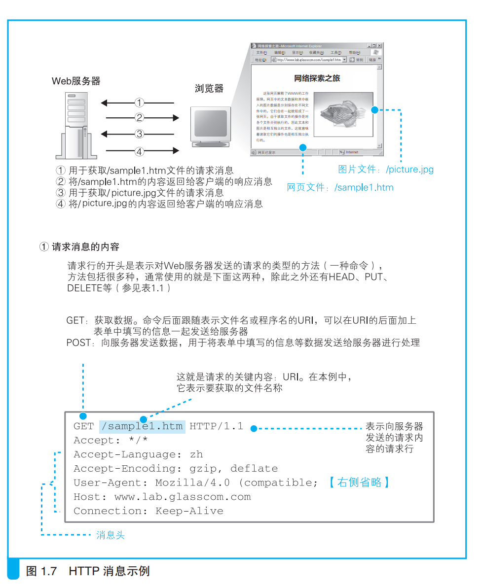
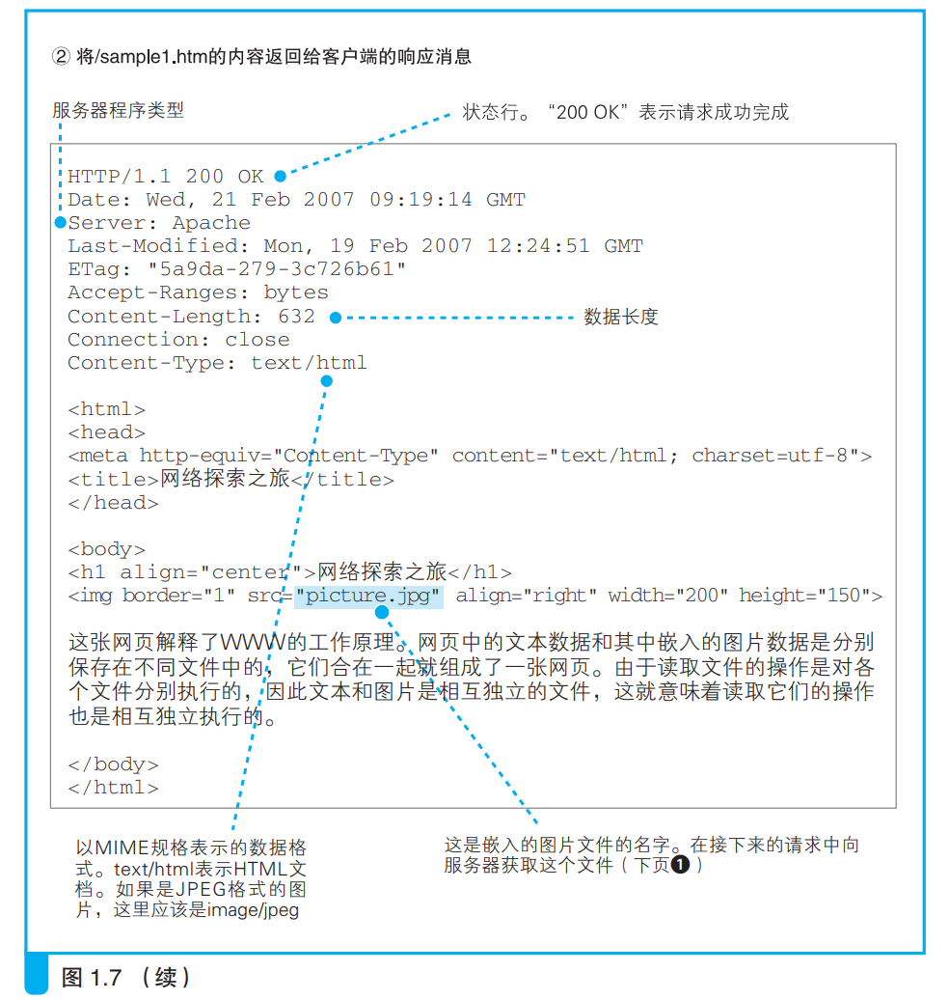
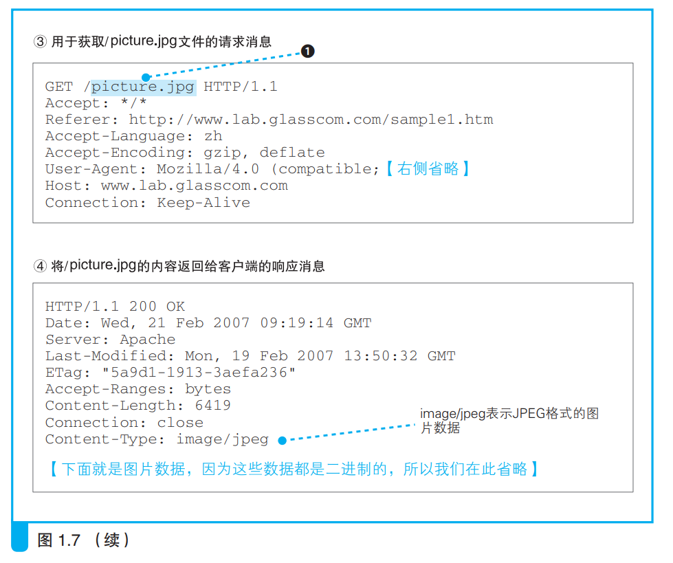

### 发送请求后会收到响应
---
发送请求消息后，服务器会返回一个响应消息。

响应消息的格式和请求消息大致相同。区别在于响应头的部分是状态码和响应短语，这两个东西都是用来表示响应的消息的状态。

浏览器收到响应消息后会把响应消息中的信息显示在屏幕上，如果是纯文本，则直接显示完全部文字信息。

浏览器在显示信息时会搜索标签，纯文本标签会直接把文字放在屏幕上，当遇到图片标签时，浏览器会在屏幕上预留空间，然后访问图片标签中指向的服务器文件位置，以该位置作为URI访问服务器得到图片并加载在屏幕上。

Web服务器只根据请求消息返回相应的数据，不参与网页的排版等工作。

**如果一个网页包含三个图片，那么这个网页内容连同三个图片就是四个文件。浏览器发送请求消息用一个URI访问获取一个文件，四个文件就需要发四次消息来获取。**
 

下面是一个示例：

