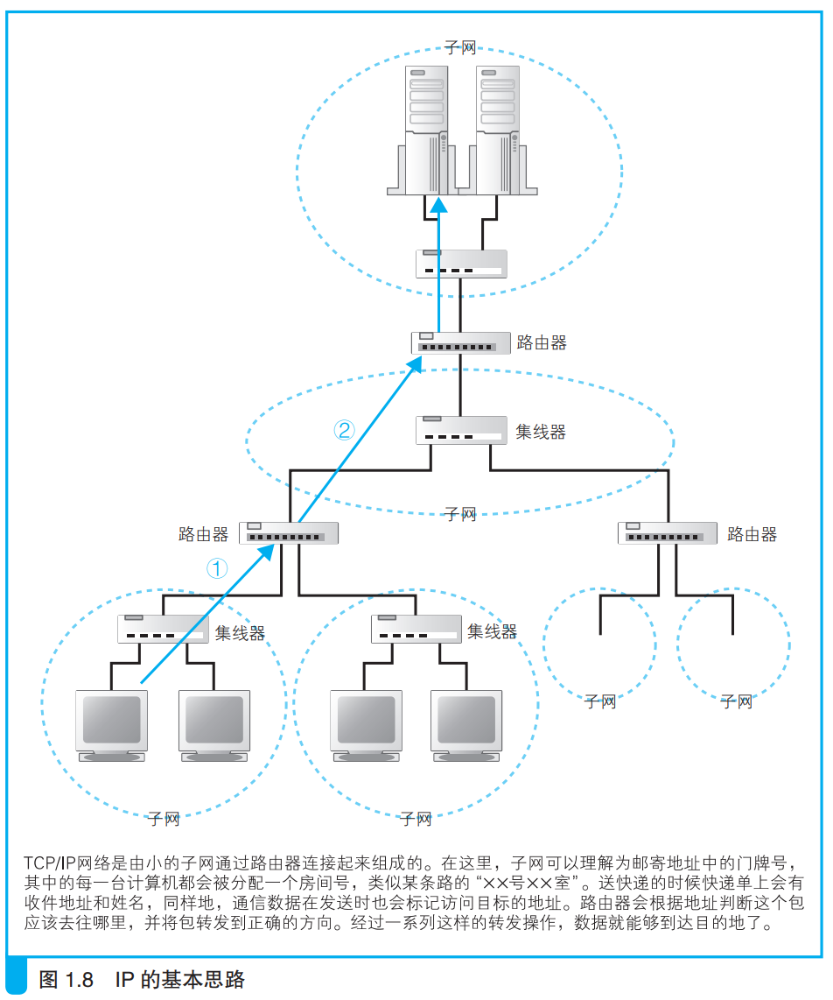
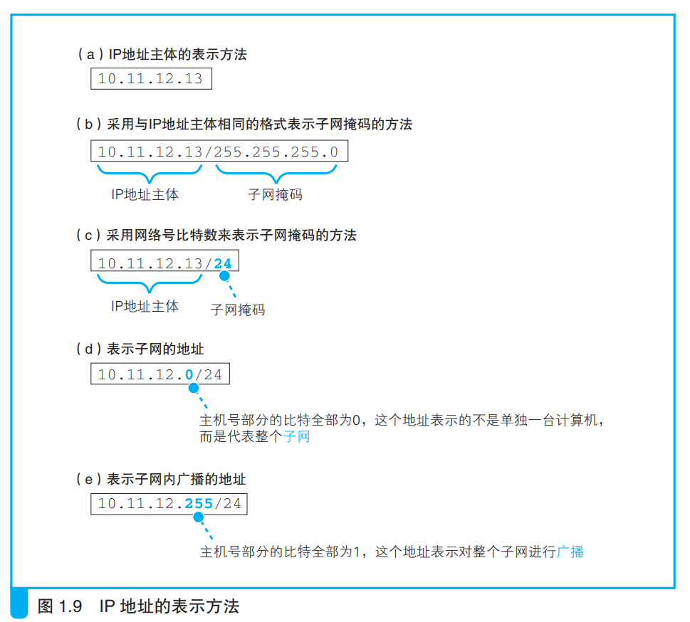
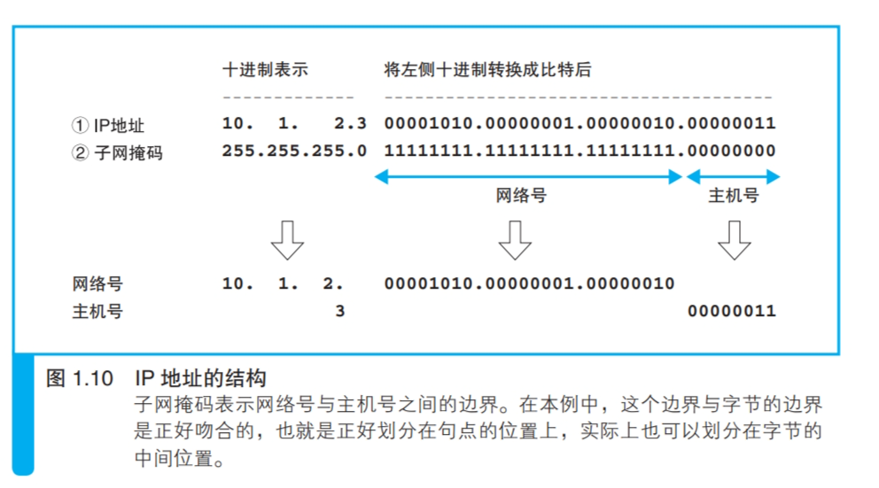
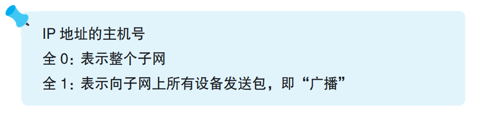

### IP地址的基本知识

浏览器生成http消息之后，先根据域名查询出目标服务器的ip地址，然后将消息委托给操作系统发送到网络上。

如下图所示是基于TCP/IP设计的网络结构。互联网或公司局域网都是基于TCP/IP思路设计的，通过路由器将子网连接在一起形成网络。

实际上的IP地址是一串32bit的二进制数字，每8位为一组，分四组，每组用十进制数字表示，每个数字之间用小数点隔开。

仅凭这么一串数字无法得知那一部分是网络号，那一部分是主机号。

<i>网络号：网络中某个子网的编号</i>

<i>主机号：子网中某个计算机的编号</i>

通过附加信息（子网掩码）可以得知ip地址的结构，从而知道网络号和主机号。

如上图b所示，子网掩码实际上就是一串和ip地址位数相同的二进制数，也是32位，其中全为1的部分对应ip地址中网络号的部分，剩下为0的部分表示主机号。

另一种方式如图c，和b的含义一样，只是用十进制表示网络号的位数。

