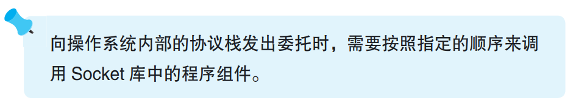
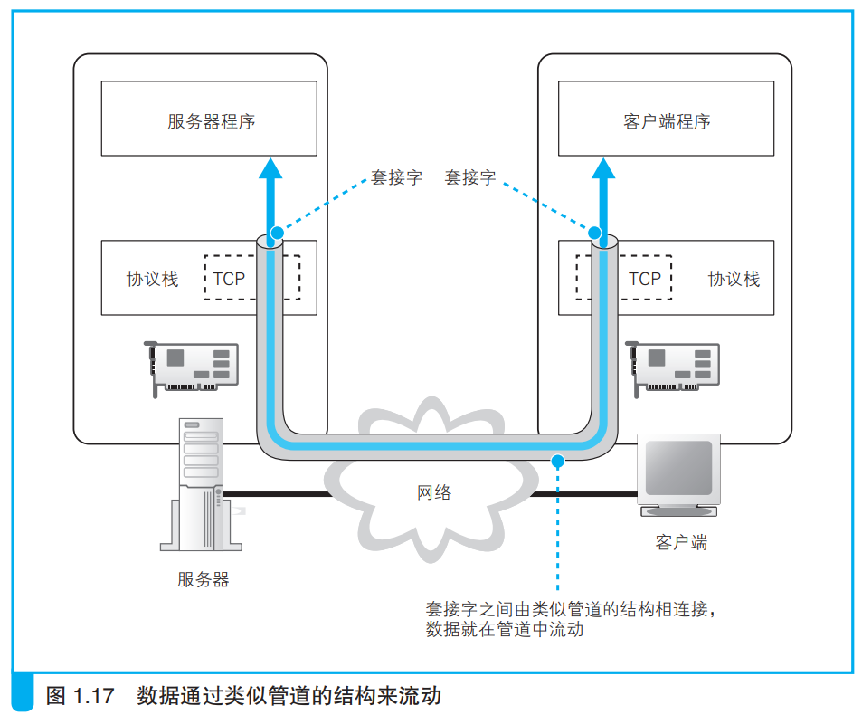

### 数据收发操作概览

获得目标服务器的ip地址后就可以委托协议栈发送消息了。发送的消息是数字信息，实际上不止发送消息，各种应用网络的程序都是通过这种方式来发送数字信息的。

委托协议栈发送消息需要调用Socket库的各种程序，并按照一定顺序执行。

Socket库收发数据的过程大致可以理解为两台计算机之间连通了一条数据管道，管道中的数据双向流动。

在创建管道之前需要先创建套接字，一般来说服务器会先创建好套接字，然后客户端创建套接字并连接到服务器，这样数据管道就建好了。两边的数据通过套接字流通。

当数据传送结束时，就可以断开管道。断开管道前由客户端和服务端任意一方发起断开管道，管道即断开，管道断开后，双方的套接字删除。
 

综上所述，收发数据的操作分为若干个阶段，可以大致总结为以下 4 个:
1. 创建套接字（创建套接字阶段）
2. 将管道连接到服务器端的套接字上（连接阶段）
3. 收发数据（通信阶段）
4. 断开管道并删除套接字（断开阶段）

数据收发的操作都是浏览器委托协议栈进行的，Socket库在其中充当了桥梁的作用。也就是浏览器调用Socket库，然后Socket库调用操作系统的协议栈。