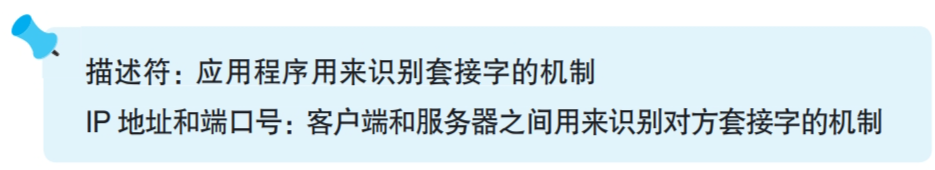

### 连接阶段：把管道接上去

---

应用程序调用connect函数完成管道连接，参数为描述符，服务器ip，端口号

- 描述符：connect函数将描述符交给协议栈，协议栈会使用对应的套接字进行连接
 

- 服务器ip：协议栈会找到ip对应服务器的套接字进行连接
<i>应该注意，IP 地址不是分配给每一台设备的，而是分配给设备中安装的网络硬件的。因此，如果一台设备中安装了多个网络硬件，那么就会有多个IP 地址。</i>
 

- 端口号：服务器同样有许多套接字，通过端口号可以指定连接到哪一个套接字。
<i>端口号的分配是一开始就规定好的，比如Web服务是80端口，电子邮件是25端口</i>

---
协议栈在发送消息前会给客户端的套接字随机分配一个端口号，并在连接时将这个端口号交给服务器，服务器就可以将响应消息返回给这个端口号对应的套接字。

连接管道的过程实际上就是客户端和服务器互相把对方的信息存在自己的套接字中，这样发送消息就知道给谁发送了。

