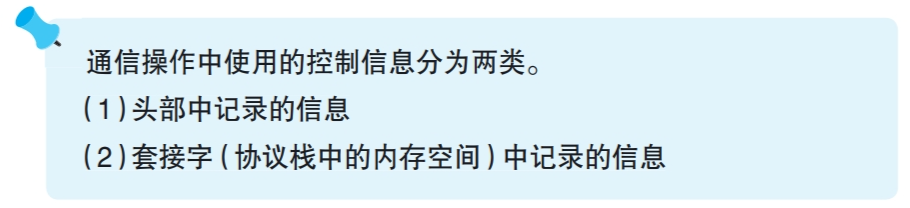
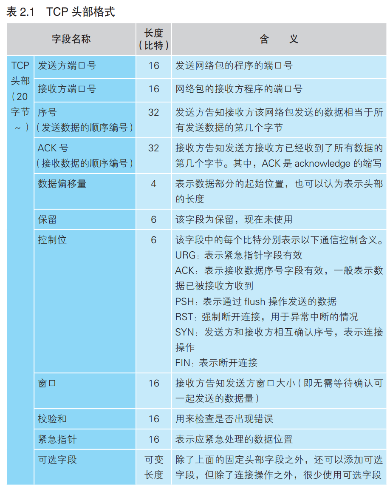

### 负责保存控制信息的头部



---

控制信息可分为两类，第一类是客户端和服务器相互联络时交换的控制信息，在TCP协议中进行了定义，如下图所示

- 这些信息是固定的，在连接、收发、断开等各个阶段，每次通信时都要提供这些信息。

- 这些信息被发在网络包的开头，在连接阶段，由于没有准备好收发数据，网络包中只有控制信息。

- 这些信息也叫头部，以太网和ip协议也有自己的头部，为了区分开分别将它们称为TCP头部，以太网头部（MAC头部），ip头部

客户端和服务器首先确认头部信息，然后才会开始收发数据，过程大致如下：
```
发送方：“开始数据发送。”
接收方：“请继续。”
发送方：“现在发送的是 ×× 号数据。”
接收方：“×× 号数据已收到。”
……（以下省略）
```

---

另一类是存在套接字中，用来控制协议栈操作的控制信息。这些信息包含了应用程序和服务器传递的信息，收发数据的执行状态信息，

