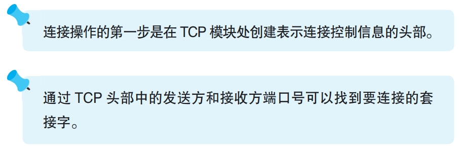
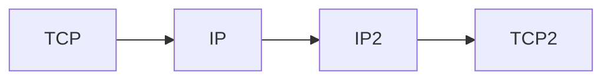

### 连接操作的实际过程

连接操作是从调用Socket库的connect程序开始的
```
connect（< 描述符 >, < 服务器 IP 地址和端口号 >, …）
```
上述代码会把目标服务器的ip和端口号交给协议栈的TCP模块，协议栈的TCP模块会与目标服务器的TCP模块交换信息。
在这一过程中，客户端首先创建一个网络包头部表示数据收发操作的控制信息，通过控制信息客户端套接字就找到服务端套接字，然后将控制信息的SYN比特位设为1表示连接。



---

TCP头部创建好后，TCP模块委托给IP模块发送。IP模块把信息通过互联网发送给服务器IP模块，服务器IP再交给服务器TCP，服务器TCP根据传递过来的头部信息中的端口号找到待连接的套接字，该套接字写入信息并将状态设置为正在连接。

完成上述操作后，服务器TCP返回响应，过程与客户端发送消息相同，也要把双方端口号发在头部，并设置SYN位为1。

此外，返回响应时还要将ACK设置为1，表示收到响应。

双方收发消息过程均如下所示


客户端接到服务器TCP头部后，查看SYN为1，则将服务器ip和端口等信息写入套接字，并修改套接字状态为连接完成。此时客户端设置ACK为1并发送网络包给服务器，告知服务器收到响应。至此连接操作完成。


