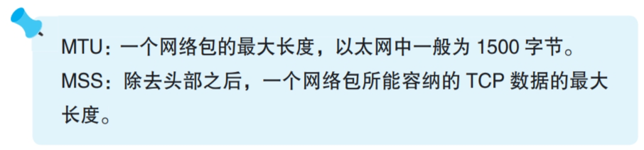
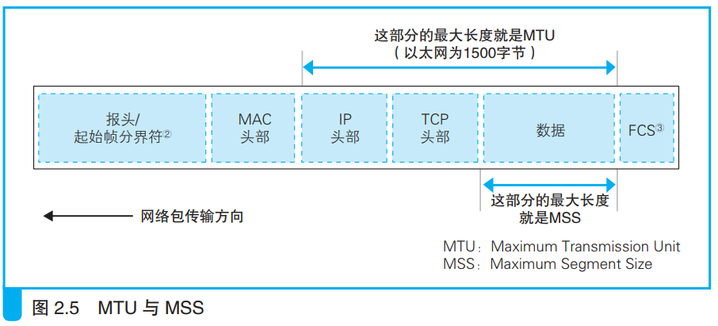

### 将 HTTP 请求消息交给协议栈

应用程序使用write函数将消息交给协议栈，然后开始数据收发。

1. 应用程序将数据和数据长度都交给协议栈，在协议栈看来程序交给自己一段二进制字节序列。

 

2. 协议栈收到数据后放在发送缓冲区中，等到数据量达到一定程度才会发送，不同操作系统的数据量条件不同，判断依据如下：

    1. 协议栈根据MTU（<i>Maximum Transmission Unit，最大传输单元。</i>）参数判断网络包最大长度。MTU减去头部长度就是可容纳数据长度MSS（<i>Maximum Segment Size，最大分段大小。</i>），当数据量接近或超过MSS就发送网络包。
    
    
    2. 协议栈内部有一个计时器，时间一到就发送网络包，这是为了防止数据量一直不到而造成的网络延迟出现。

 

3. 仅靠协议栈来发送数据可能造成一些问题，因此可以在应用程序中直接设定发送数据的时机。比如浏览器这种会话型就设置一传递数据就直接发送。

