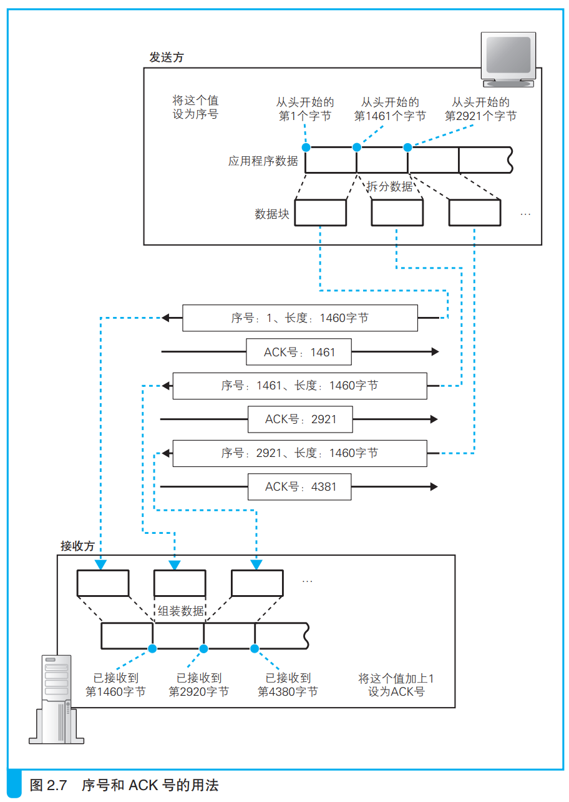
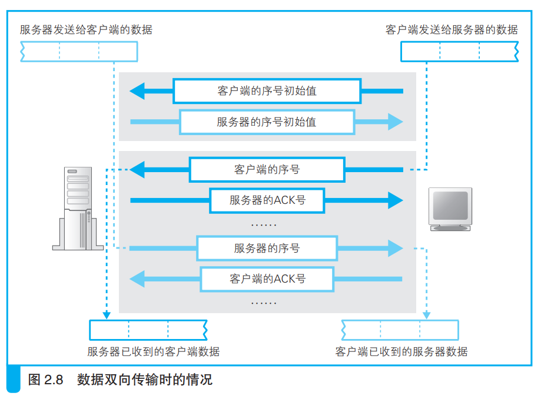
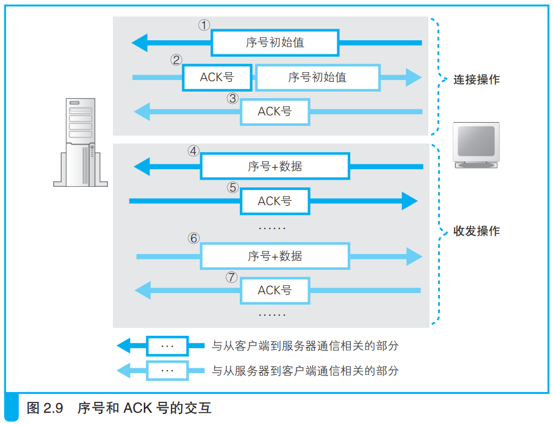

### 使用 ACK 号确认网络包已收到

发送网络包后，还需要进行确认操作。

拆分后的网络包需要知道其中的数据是第几个字节开始，长度是多少。TCP在拆分时就会计算好是第几个字节并放在头部，服务端通过用网络包长度减去头部长度得知数据长度。

接收方会将收到的数据字节写入TCP头部的ACK号中，并将ACK比特位设置为1（表示ACK字段有效），然后把这一网络包发给客户端，表示接收到数据。

一般来说序号的第一个并不是1，而是一个随机数计算得到的值，这是为了防止有人针对序号进行攻击。
序号初始值的设置是在置SYN的同时完成的。序号的初始值与SYN会一起发送给服务器。

数据双向发送的过程如下所示：

序号和ACK号的交互过程如下：

TCP通过ACK号确认对方是否收到消息，发送过的数据会存在数据缓冲区中，如果对方返回的ACK号缺失，就将缺失ACK号对应的数据重新发送过去。

如果出现网络中断，服务器停止运行等情况，TCP就会重发几次后强制中断连接并向应用程序报错。

