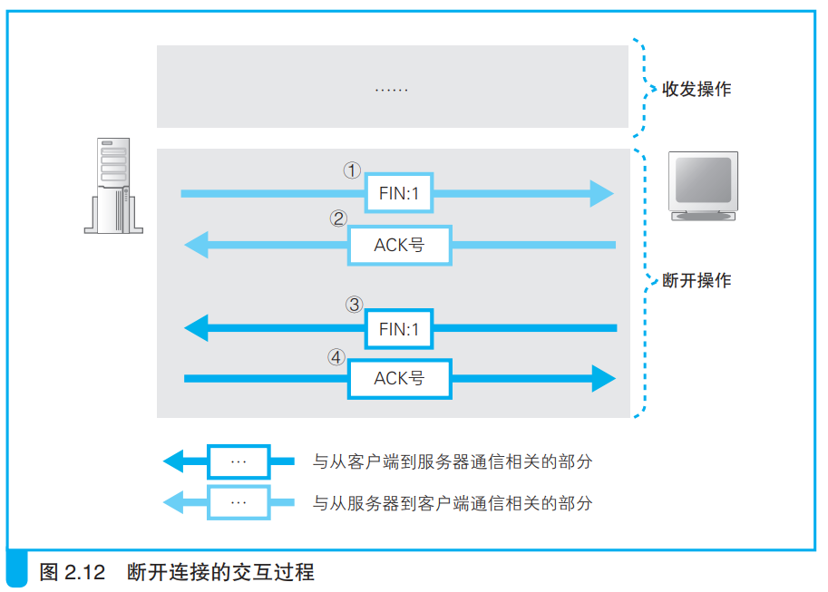
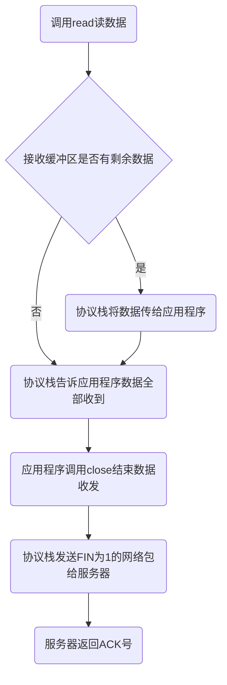

### 数据发送完毕后断开连接

在http1.0中，当服务器返回响应消息后数据收发就结束了，此时服务器进行断开连接操作。在一些情况下，客户端不需要接收响应消息就直接断开连接。协议栈允许通信双方任意一方断开连接。

---

以服务器断开连接为例，包含下列四个操作：
1. 调用close函数
2. 控制流程转到协议栈，协议栈将TCP头部包含断开连接信息（FIN比特位设为1）的网络包委托给IP模块
3. IP模块将网络包发送给客户端
4. 同时套接字中记录断开连接操作的信息

客户端收到服务器的网络包后，进行如下操作：
1. 协议栈将套接字状态改为断开连接状态
2. 返回收到此网络包的ACK号

如下图所示：

客户端返回ACK号之后，会调用read程序读数据。如果read在收到网络包之前就被调用，那么read程序会被挂起，直到收到网络包。

至此，客户端和服务器的通信结束。