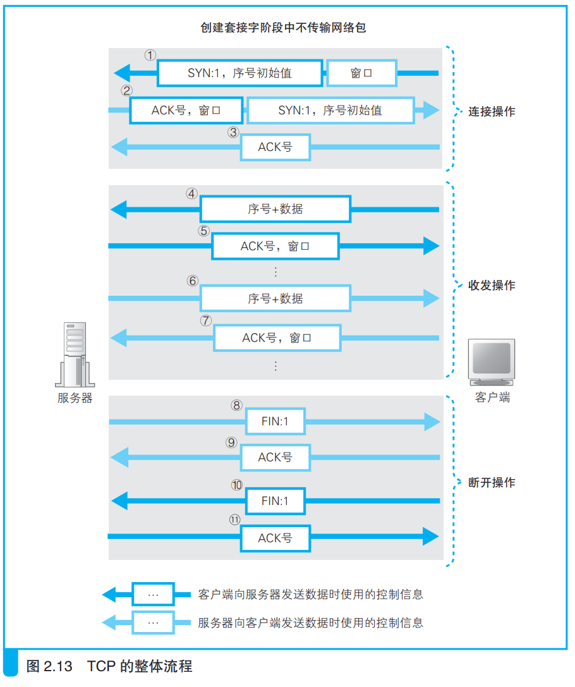

### 数据收发操作小结

数据收发简要流程如下

1. 创建套接字
    - 服务器会事先创建好套接字等待连接
    - 客户端会在发生访问浏览器等特定动作时创建套接字
    - 此时还没有开始网络包的发送
 

2. 发起连接操作
    - 客户端向服务器发送TCP包，其中SYN位为1，包含了初始序列号和服务器使用的窗口大小。
    - 服务器收到网络包后，向客户端发送TCP包，其中SYN位为1，包含了初始序列号和服务器使用的窗口大小，还有收到包的ACK号。
    - 客户端收到服务器的包后，再返回一个包含ACK号的包。
 

3. 数据收发
    - 客户端向服务器发送请求消息，TCP将消息分成一定大小的数据块，在每个数据块前加上TCP头部，然后发给服务器。
    - 服务器收到数据后返回ACK号。
    - 服务器将数据从缓冲区交给应用程序后，向客户端发送窗口更新消息。
    - 服务器处理完数据向客户端发送响应消息，过程和客户端发送请求消息一样，也涉及到ACK号和窗口更新消息的发送。

4. 断开操作
    - http1.0中，服务器先发送FIN为1的TCP包
    - 客户端返回ACK号
    - 客户端发送FIN为1的TCP包
    - 服务器返回ACK号
    - 等待一段时间删除套接字

TCP图示流程如下：

