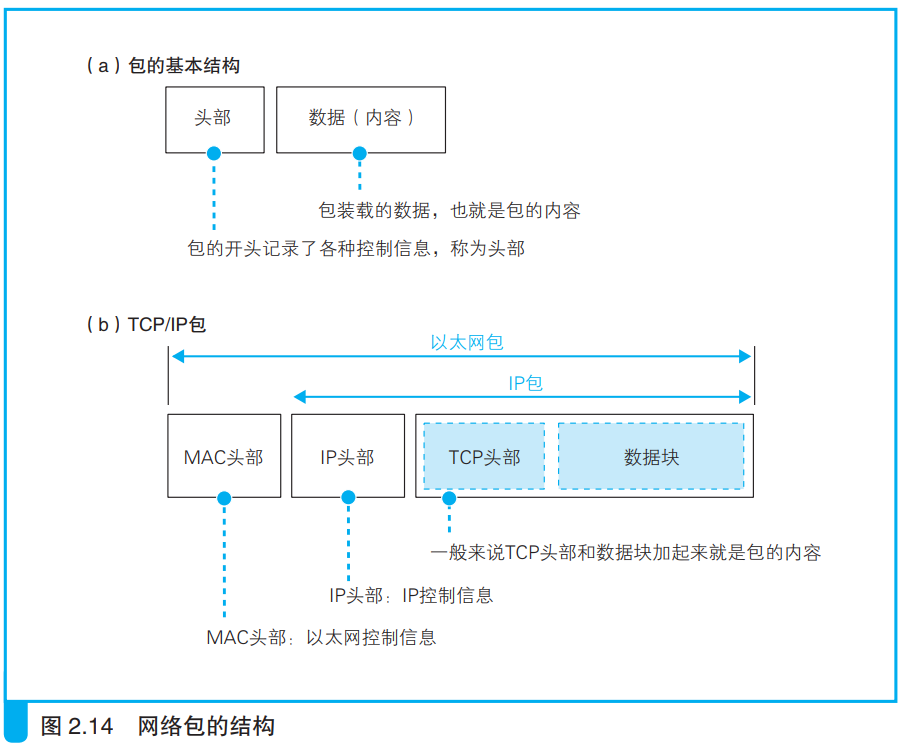
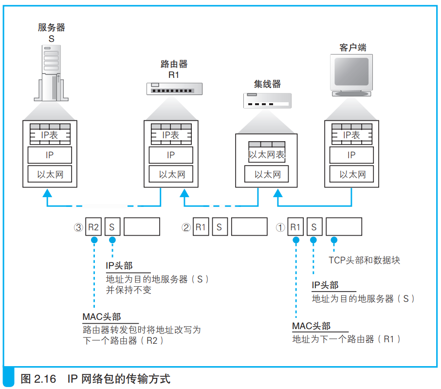

### 包的基本知识

网络包由头部和数据组成，头部包含各种控制信息。

发送方的网络设备创建包，然后包被发给最近的网络转发设备。网络转发设备会根据包中的控制信息和自身存储的查询表来把网路包发送到另一个转发设备，这样依此传递网络包，最终网络包发到了接收方这里。

接受方可能会返回一个包，过程与发送方过程相同。可见不需要区分接收方和发送方，因此统一称为终端节点，中间的网络转发设备称为转发节点或中转节点。

> 路由器和集线器是两种不同的转发设备，功能不同：
> 1. 路由器根据目标地址判断下一个路由器的位置
> 2. 集线器在子网中将网络包传输到下一个路由
>
> 集线器遵循以太网协议，路由器遵循ip协议：
> 1. IP 协议根据目标地址判断下一个 IP 转发设备的位置
> 2. 子网中的以太网协议将包传输到下一个转发设备
>
> TCP/IP头部包含两个头部：
> 1. MAC头部（以太网协议）
> 2. IP头部（IP协议）

IP协议根据ip地址找到传输方向从而找到下一个路由器，查找到路由器的MAC地址后委托给MAC协议将网络包发给下一个路由器。

网络包传输时经过集线器，集线器根据MAC地址和自身存储的查询表找到网络包传输方向，然后把它交给下一个集线器。

> <i>以太网可以用无线局域网、ADSL、FTTH 等代替。</i>

