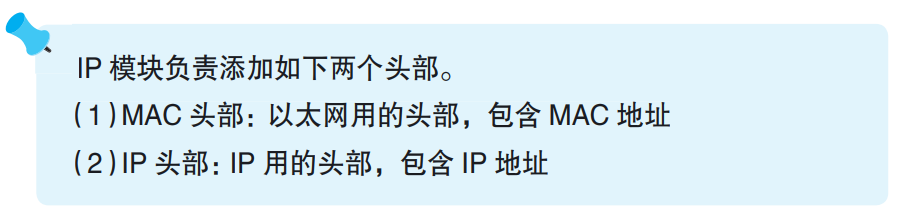
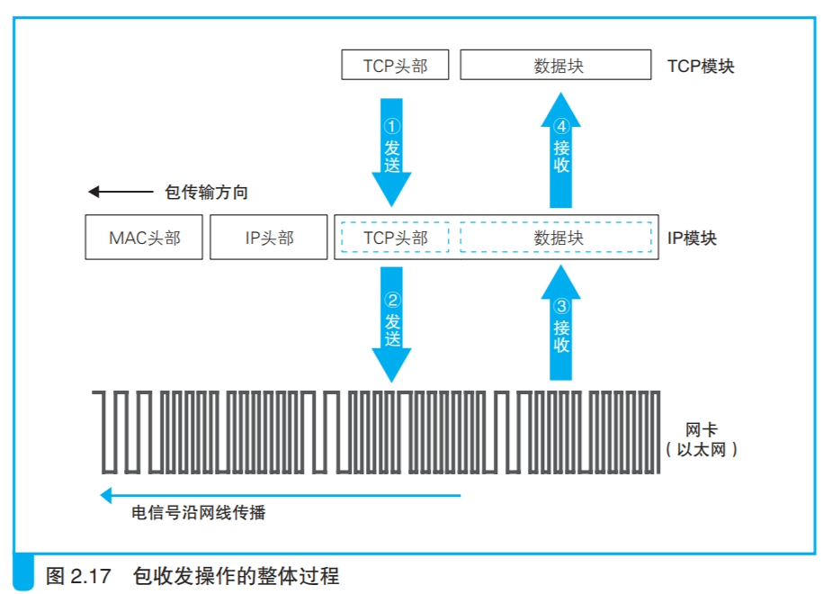
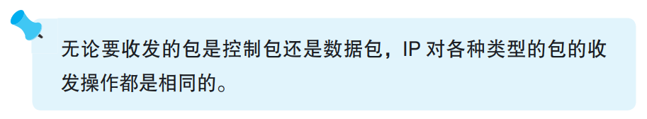

### 包收发操作概览

IP模块是包传输的入口，实际工作由集线器、路由器等网络设备完成。

TCP模块给数据添加完TCP头部后，把一整块数据交给IP。IP根据IP协议添加IP头部，包含送往目的地的控制信息，根据MAC协议添加MAC头部，包含局域MAC网传输的下一个路由器地址的控制信息。

封装好的包被IP以二进制数据交给网卡，网卡将数字信息转换为电信号（光信号）通过网线（或光纤）传送给路由器或集线器，最终数据交给接收方。

> <i>网络硬件，例如以太网、无线局域网等。网络硬件可能是插在计算机主板上的板卡，也可能是笔记本电脑上的 PCMCIA 卡，或者是计算机主板上集成的芯片，不同形态的硬件名字也不一样，本书将它们统称为网卡。</i>

接收方返回的包通过网线传递到客户端的网卡上，网卡将电信号转化为数字信息，然后交给IP模块，IP模块把TCP头部和数据块交给TCP模块处理。

