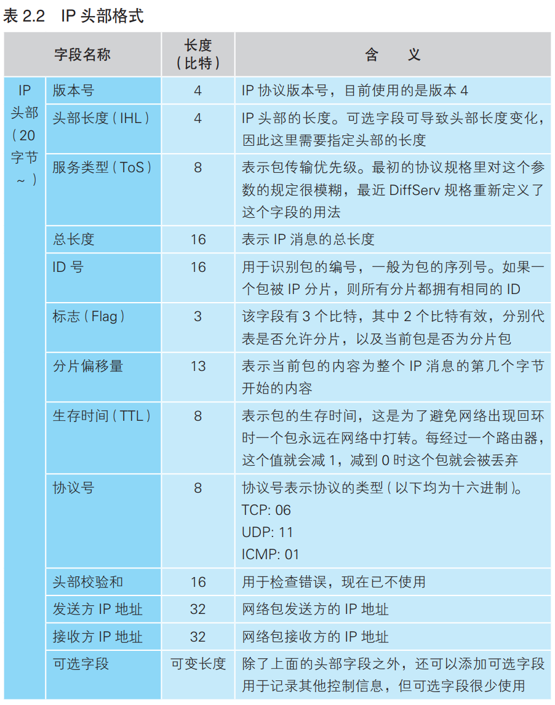
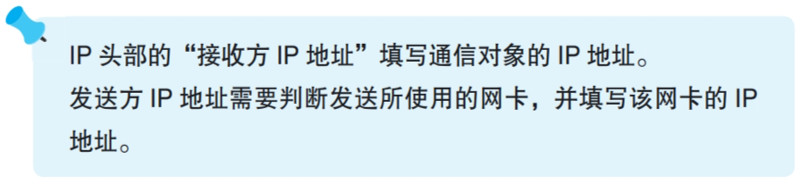
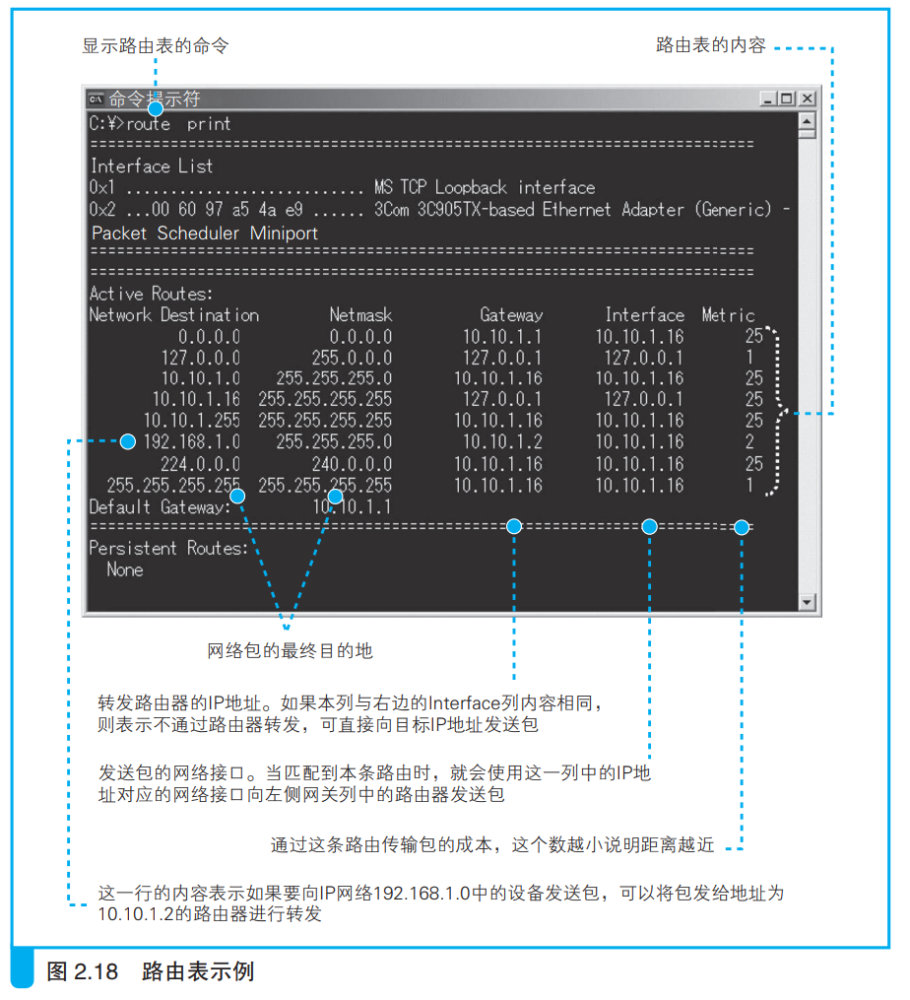

### 生成包含接收方 IP 地址的 IP 头部

IP模块根据从TCP头部得到的信息形成IP头部。

协议栈和路由器的包收发的操作都根据IP协议完成。路由器通过路由表判断把包发给谁，如下所示：

> 上述表中的列名分别为：
> 1. Network Destination: 目标网络，如目标地址是192.168.1.12，就找到对应的192.168.1.0；第一行是默认网关，当匹配不到时就匹配这一行。
> 2. Netmask: 子网掩码。
> 3. Gateway: 下一个路由器地址
> 4. interface: 所用的网络接口（网卡）地址

