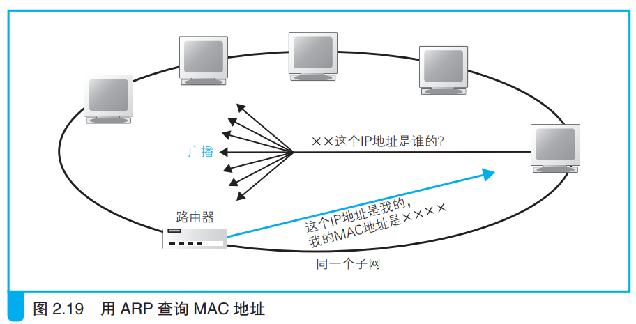
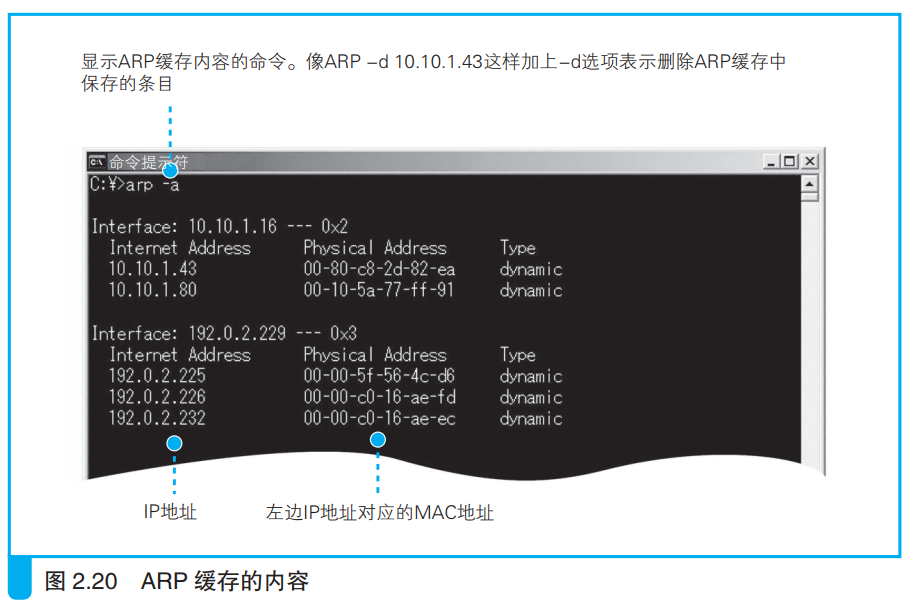
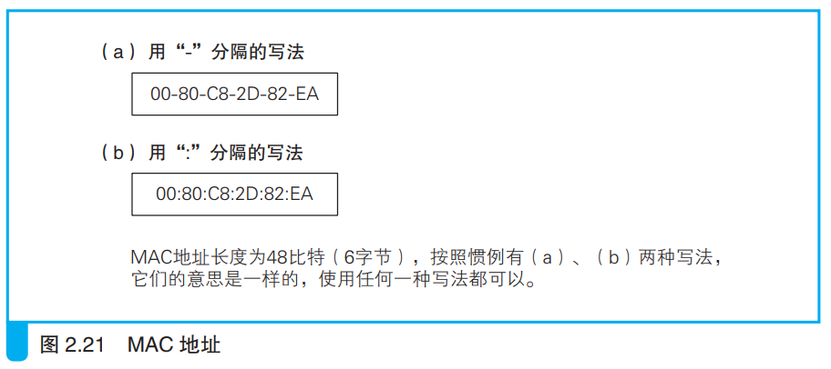

### 通过 ARP 查询目标路由器的 MAC 地址

> <i>ARP：Address Resolution Protocol，地址解析协议。</i>

ARP利用广播对以太网内所有路由器询问ip地址对应的MAC地址是谁。

每次发送一个ARP包都会得到一个返回结果，将返回结果放在ARP缓存中，下次查询前先在ARP缓存中查看，如果有目标MAC地址，就不需要询问。

ARP缓存中的值过上几分钟就会删除，这是因为实际中的MAC地址可能会发生变动。

有时候ARP缓存刚刚保留MAC地址，实际MAC地址就发生改变，这种情况下就会发生通信错误，可以手动查看ARP缓存并删除错误条目。

整个添加MAC头部的工作都由ip模块负责，网卡只需要发送。这样就可以让网卡能发送各种类型的网络包，提高了网卡的灵活性。