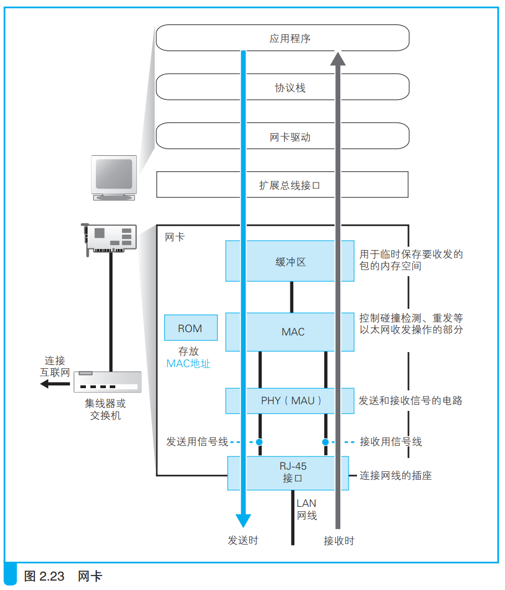
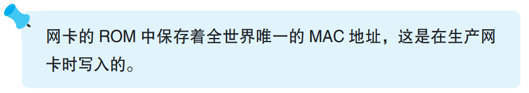
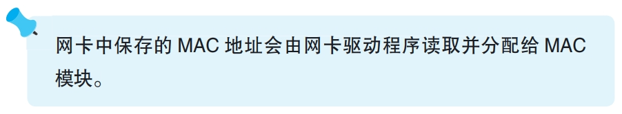

### 将 IP 包转换成电或光信号发送出去

下面是一张网卡的主要要素的概念图：

计算机启动时网卡驱动程序进行初始化，初始化操作包括硬件错误检查、初步设置、MAC地址设置等。

> <i>MAC：Media Access Control 的缩写。MAC 头部、MAC 地址中的 MAC 也是这个意思。也就是说，通过 MAC 模块控制包收发操作时所使用的头部和地址就叫作 MAC 头部和 MAC 地址。
</i>

