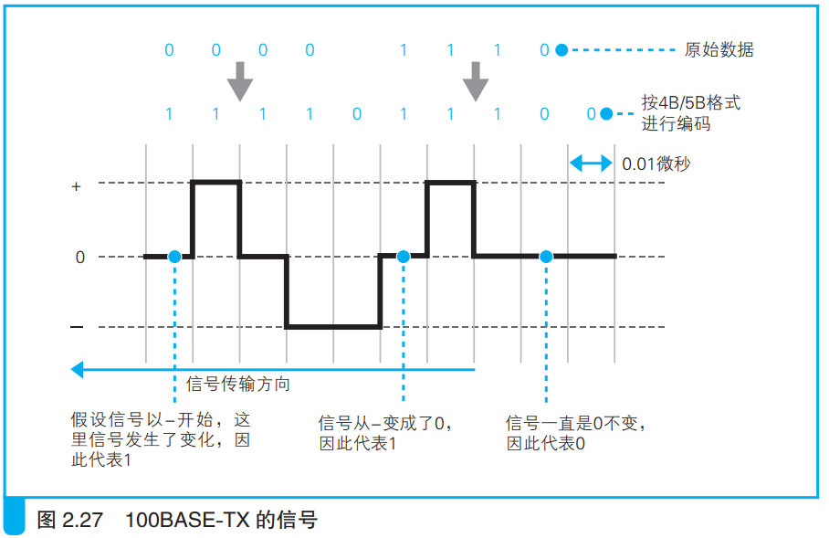
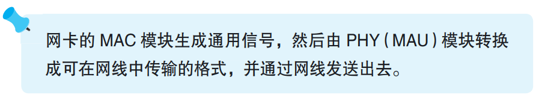

### 向集线器发送网络包

信号的发送操作有两种，一种是使用集线器的半双工模式，一种是使用交换机的全双工模式。

> <i>发送和接收同时并行的方式叫作“全双工”，相对地，某一时刻只能进行发送或接收其中一种操作的叫作“半双工”</i>

在半双工模式中，当集线器中有别的信号传输时需要等待传输完成，然后再发送信号。

MAC模块从报头开始把数字信息转换为电信号，然后交给PHY（MAU）的信号收发模块发送出去。

> <i>根据以太网信号方式的不同，有些地方叫 MAU（Medium Attachment Unit，介质连接单元），有些地方叫 PHY（Physical Layer Device，物理层装置）。在速率为 100 Mbit/s 以上的以太网中都叫 PHY。</i>

数字信息转换为电信号的速率就是网络传输速率，比如每秒转换10MB数字信息，网络传输速率就是10MB/s。

以太网对不同网线类型和传输速率以及其对应的信号格式有不同的规定。MAC模块将通用信号格式交给PHY(MAU)模块，PHY(MAU)将其转换为符合传输要求的信号格式。举例如下：

发送信号前PHY(MAU)先检查网线中有没有信号传输过来，没有的话就发送信号。

在开始发送到结束发送之间一直没有信号传输过来，就说明发送成功。

以太网中两台服务器网线的距离不超过100米，这个距离内极少发生错误，就算发生错误也可以由TCP模块修正，因此无需在发送信号时检查错误。

在半双工模式下，有时发送信号和接收信号发生信号碰撞，此时就会停止信号发送。然后集线器会发送一段时间阻塞信号，通知全部设备此线路发生信号碰撞，之后所有设备停止发送信号。

> <i>阻塞信号：以太网中发生碰撞时，为了告知所有设备而发送的一种特殊信号。</i>

等待一段时间后，所有设备开始重新发送信号。为了防止再次碰撞，发送信号的时机相互错开。等待的时间根据MAC地址生成一个随机数决定。

当网路拥塞时，发生碰撞的可能性更高。如果发生一次碰撞后，又发生了碰撞，就让第二次的等待时间延长一倍。如果还是发生碰撞，就继续延长一倍。如果第十次还是发生碰撞，就停止发送信号，报告通信错误。

