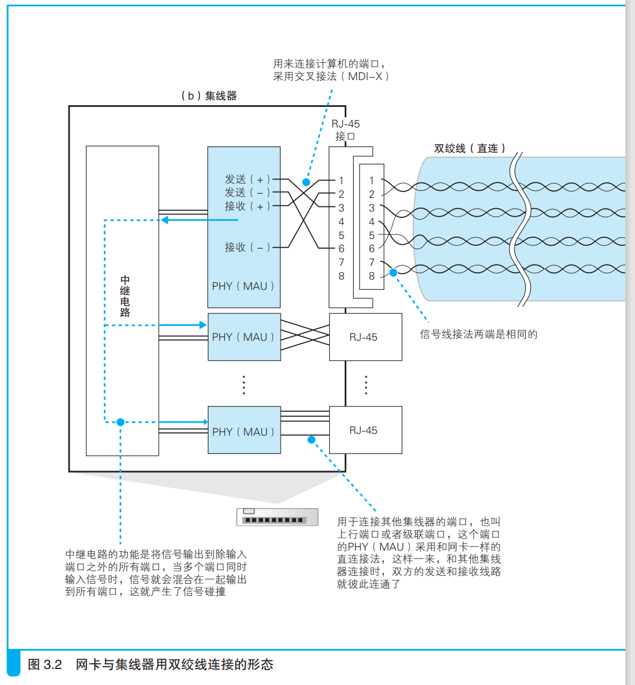
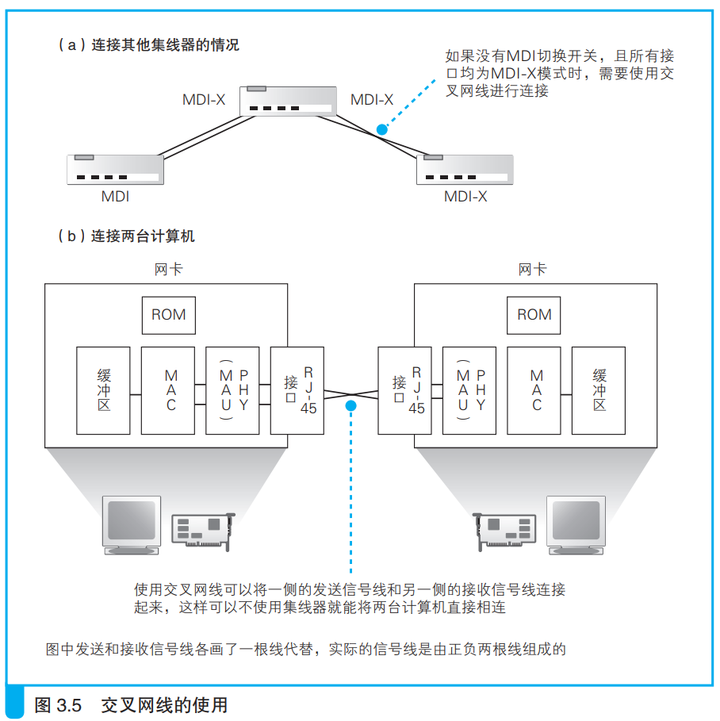
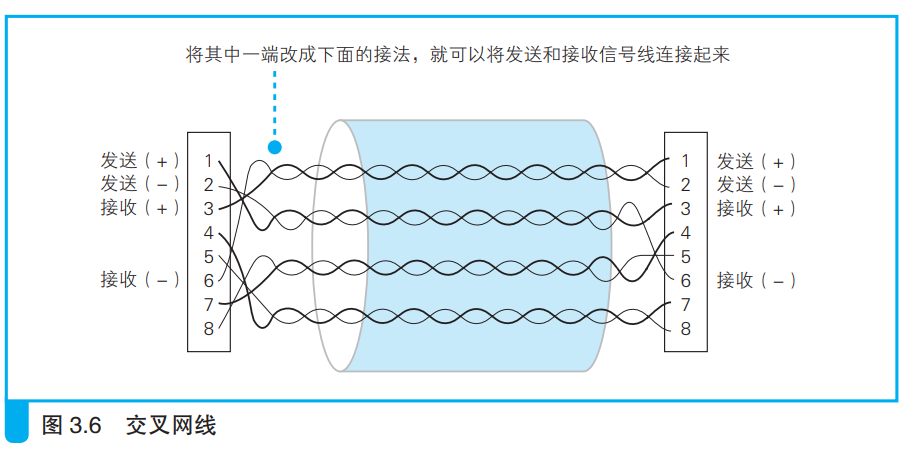

### 集线器将信号发往所有线路

集线器按照以太网基本架构，将接收到的信号广播到局域网。

> <i>MDI 是 Media Dependent Interface（媒 体 相 关 接 口）的 缩 写，MDI-X 是MDI-Crossover 的缩写。</i>
>
> <i>一般集线器上都有MDI/MDI-X切换开关，也有一些没有切换开关，而是安装了 MDI 和 MDI-X 两种接口。此外，还有一些产品能够自动判断 MDI 和 MDI-X 并在两种模式间自动切换。</i>

如上图所示，集线器的PHY(MAU)模块与接口交叉接线，保证发送方的信号到达接收线路上。

集线器接口一般都是MDI-X模式，也就是交叉连线。选择什么模式要根据实际情况判断。

信号到达集线器的PHT(MAU)模块后就送到中继器，中继器负责把信号送到集线器的所有接口上。

信号从接口到达集线器连接的所有设备，这些设备根据网络包的MAC地址判断是否要留下包。

