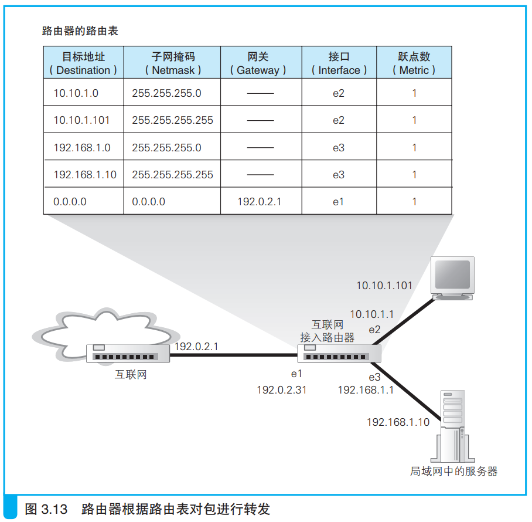
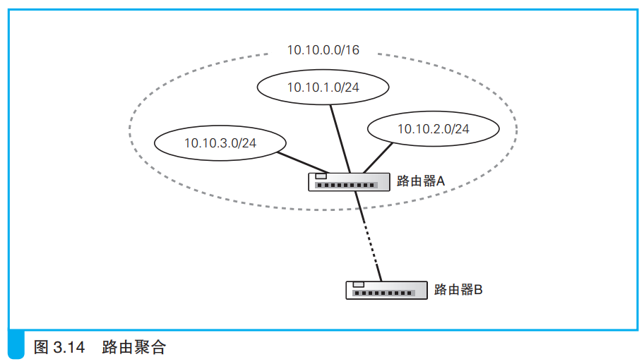

### 路由表中的信息

路由器根据IP头部的IP地址判断转发目标。

路由表的最左侧记录着接收方的信息。交换机的地址表记录接收方全部信息，路由器只记录网络号，上图中最左侧的一列全都是网络号，根据子网掩码可以判断出来。

有时地址表的地址子网掩码和实际地址子网掩码不同，这是因为经过了路由聚合，如下所示：

上图中路由聚合将三个子网合并为一个子网，路由器B将网络包只需交给路由器A，这时合并后的子网地址和子网掩码就发生了变化。

子网地址的改变也有其它情况，比如将一个子网进行细分然后将细分后的多条记录写入路由表。

子网掩码的右侧是网关和接口，根据IP地址查找到记录后，将网络包交给对应的接口（端口），然后发送到对应网关的IP地址。

最右侧的跃点数表示距离目标IP地址的距离，数值越大，距离越远。

> 路由表的维护方法大体上分为以下两类：
>
> 1. 由人手动维护路由记录；
> 2. 根据路由协议机制，路由器之间进行信息交换，由路由器自行维护记录。
> 
> 路由协议有很多种，比如RIP、OSPC、BGP。

