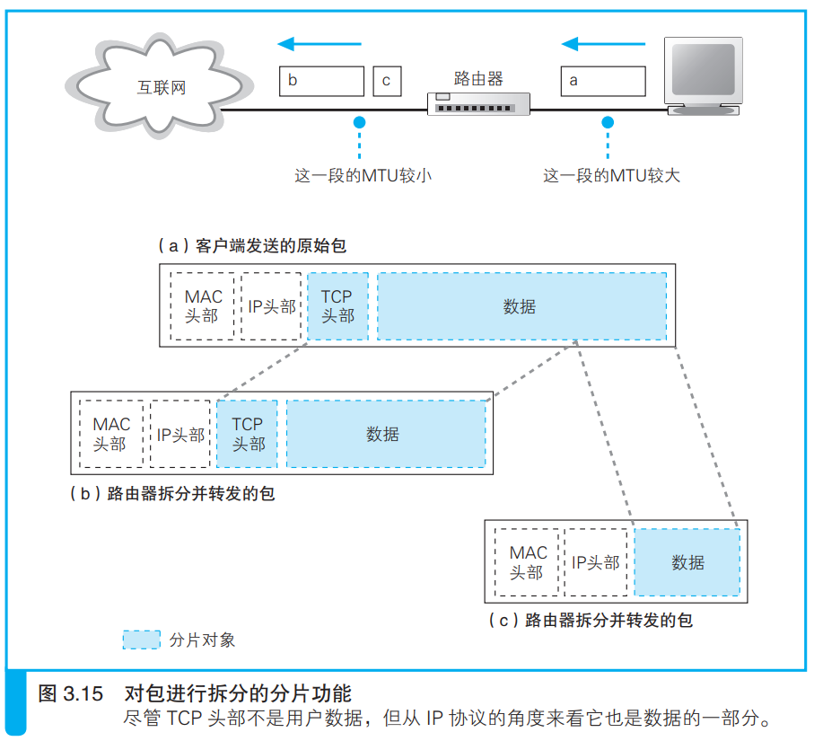

### 通过分片功能拆分大网络包

路由器不同端口支持的线路和局域网类型不同，导致端口传输包的最大长度不同，于是就有可能出现输出端口的最大传输长度小于输入端口的最大传输长度的情况。

遇到这种情况时，路由器端口的IP模块会根据MTU来进行分片，与TCP拆分数据块不同的是，IP是对整个网络包进行拆分的。

IP模块首先查看IP头部，确认是否允许分片，不允许的话就丢弃，然后发送ICMP消息，否则就拆分包，拆分后在每个小包前加上IP头部。

新的IP头部除了原来IP已有的有效字段外，还有标记该包属于原包的哪个部分的新字段等，新字段用于记录分片信息。

