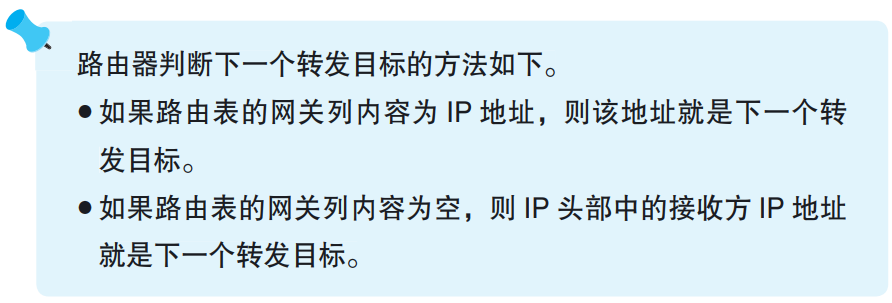

### 路由器的发送操作和计算机相同

> 本节介绍：路由器的端口根据自身类型将网络包发送给下一个路由器。以太网类型的操作和计算机网卡相同，都涉及到添加MAC头部、查找MAC地址、半双工、全双工等。

路由器的端口类型很多，诸如以太网、ADSL等等。不同类型的发送操作不同。

---

以下是以太网类型的发送操作：

对于以太网类型来说，发送网络包之前需要先添加MAC头部。IP模块先在路由表中找到下一个目标IP地址，一般都是网关地址，如果网关为空，则下一个目标IP就是接收方IP。

确定目标IP后，路由器在ARP缓存中查看是否有目标MAC地址，没有的话就通过ARP来查找MAC地址。

MAC头部的发送方MAC地址就填端口MAC地址，以太类型就填0080H。

网络包准备好后就将数字信息转换为电信号，全双工模式下直接发送电信号，半双工模式下还需要检测信号碰撞。

发送出去的网络包经过交换机到达下一个路由器，层层转发后就到达目标服务器。
