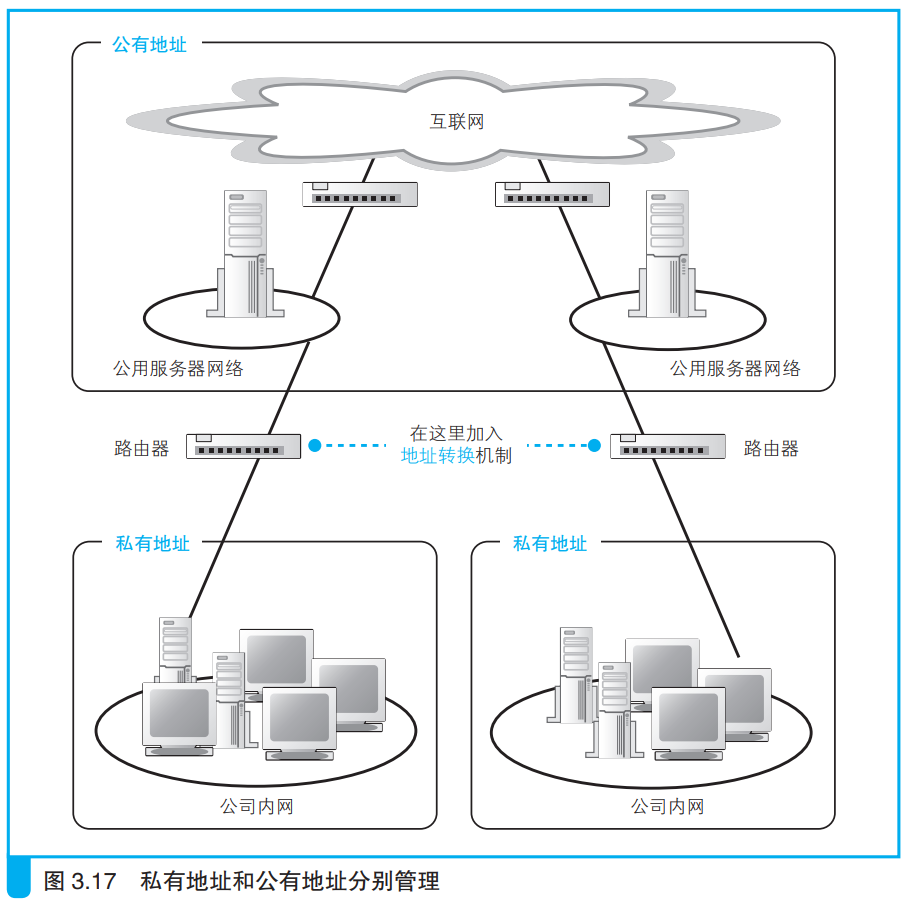

### 通过地址转换有效利用 IP 地址

> 本节介绍：互联网中的大量设备出现导致IP地址不够分配，因此划分内网和互联网。内网使用私有IP，互联网上使用公有IP。内网设备发送消息到互联网上需要经过地址转换。

20世纪90年代以后，计算机普及，连接到互联网的设备增多，出现了IP地址分配不够用的状况。

为了解决这种问题，就需要采用固定地址分配。已知公司内网之间相互独立，不同内网的设备不能直接连接，这就可以给内网用一套地址，内网之外的互联网用一套地址。

公司内网使用的地址是从原本的所有公有地址中选取一部分，这一部分设定为私有地址，其余为公有地址，在互联网中使用。

> 私有地址的规则其实并不复杂，在内网中可用作私有地址的范围仅限以下这些：
> 10.0.0.0 ～ 10.255.255.255
> 172.16.0.0 ～ 172.31.255.255
> 192.168.0.0 ～ 192.168.255.255

公司内网分两个部分，一个是开放给互联网的服务器，一个是内部其它设备。如下所示：

不同内网中的设备地址可能是相同的，因此当内网设备要向互联网发送消息时，就要使用地址转换机制。

