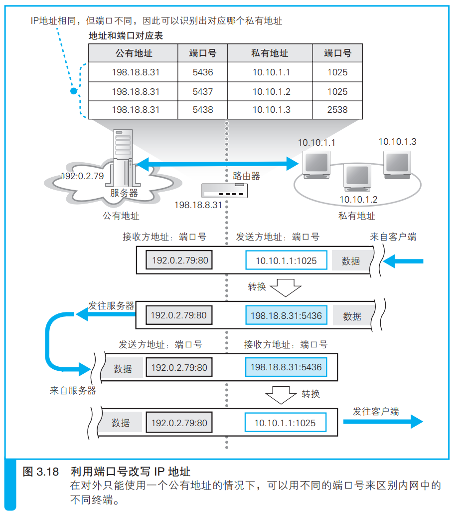

### 地址转换的基本原理

> 本节介绍：地址转换设备更改了原始私有地址和端口号，原始地址改为地址转换设备自己的公有地址，端口号改为一个空闲端口。

网络包被内网客户端发送到地址转换设备，地址转换设备修改IP头部的私有IP地址为自身互联网接入端口的公有地址。同时地址转换设备挑选一个空闲端口作为新的端口号，并把更新后的IP地址和端口号和更新前的内容记录在一张表中。

> <i>具备地址转换功能的设备不仅有路由器，有些防火墙也有地址转换功能，它的工作方式和路由器是相同的，因此这里我们虽然用了地址转换设备这个词，但在这里的上下文中指的就是路由器。</i>

如上图所示，服务器接收到网络包后也会返回一个包，返回包的IP地址是客户端地址转换设备的IP地址，端口号是对方内网空闲端口号。同样的，一般这个返回包中服务器的地址部分也是经过地址转换设备转换过的，除非该服务器直接接入了互联网。

返回包到达客户端的地址转换设备后，由地址转换设备根据表的记录将IP地址改为原来的地址和端口再发往内网，内网收到后发给客户端。

数据收发完成后，进入断开阶段，此时地址转换设备的记录就被删除了。

