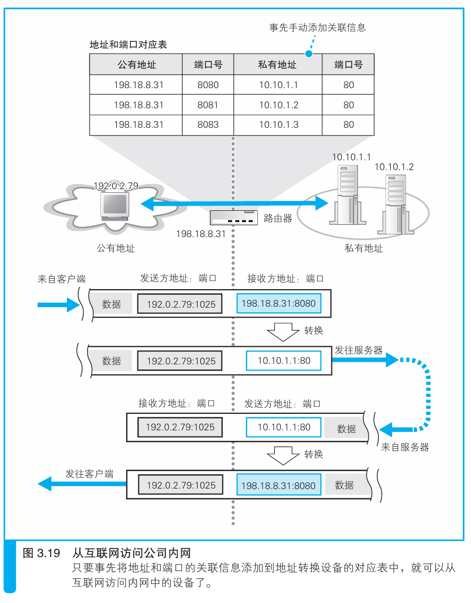

### 从互联网访问公司内网

> 本节介绍：要从互联网访问公司内网，可以将内网设备直接接入互联网并分配公网ID，或者手动在地址转换设备中注册好内网设备的私有地址。

公司内网设备可以使用地址转换设备的公有ID来作为自己的ID，从而访问互联网。但是互联网不能直接访问内网设备，因为网络包发给地址转换设备后，地址转换设备没有对应内网设备的记录，就无法正常发送包给内网设备。

这样看来，除非公司允许，否则互联网无法向内网设备发送消息。这样可以防止非法入侵。

可以通过为服务器分配公有地址，或在地址转换设备中提前设置好需要服务器的私有地址记录，就可以让互联网直接访问服务器了。

