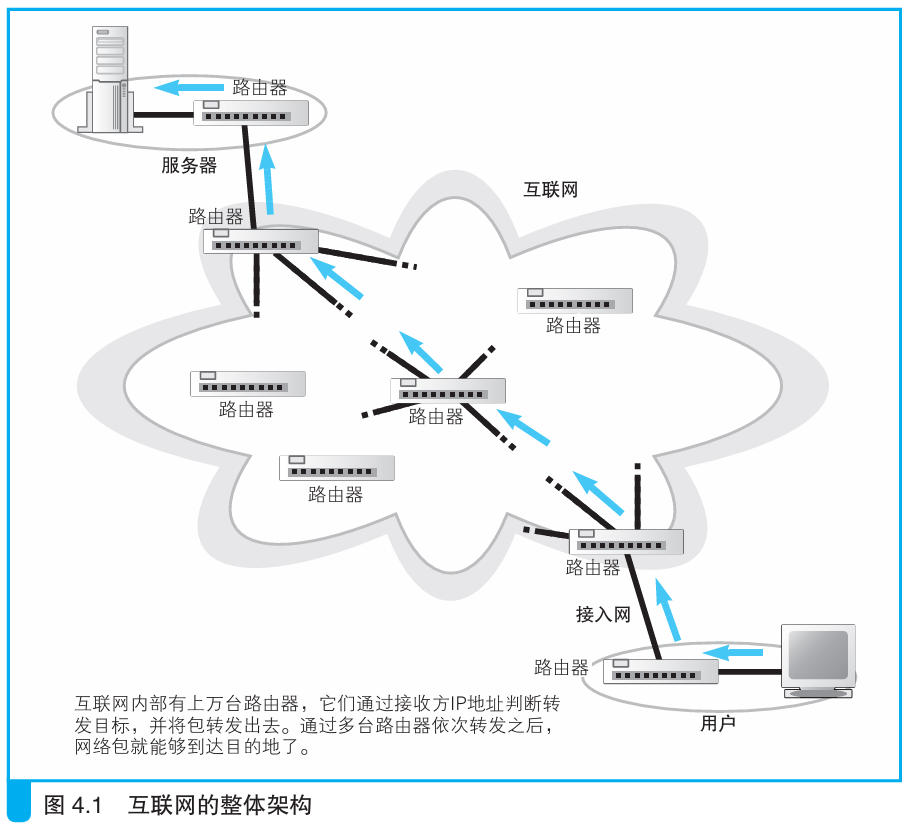

### 互联网的基本结构和家庭、公司网络是相同的

> 本节介绍：互联网结构和家庭、公司内网结构大致相同，只是在传输距离，路由器控制包的转发目标上有所差异。

互联网遍布世界，通过路由器转发包。

在家庭或公司内网中，转发设备之间的距离不过几十到几百米，延长以太网线即可扩大连接距离。但互联网的连接动辄数公里，不能使用以太网线的方式。

互联网采用自动化的方式维护路由表，在自动维护的机制上与公司内网不同。

