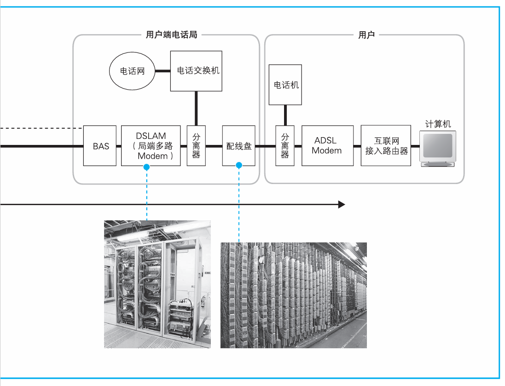
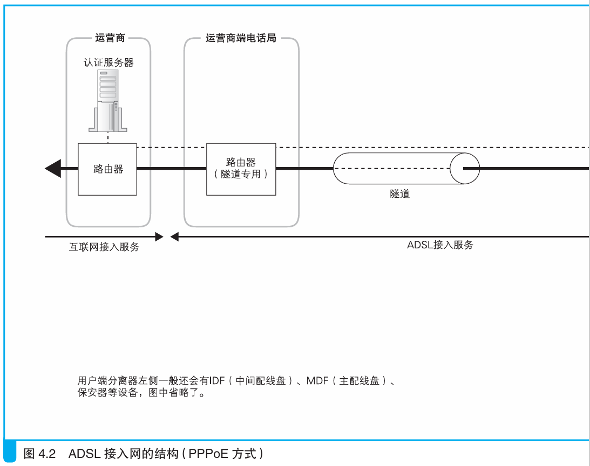
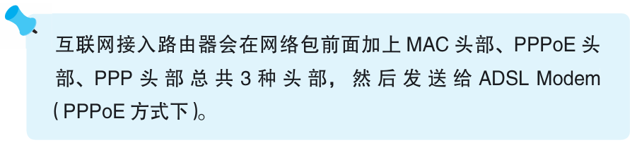
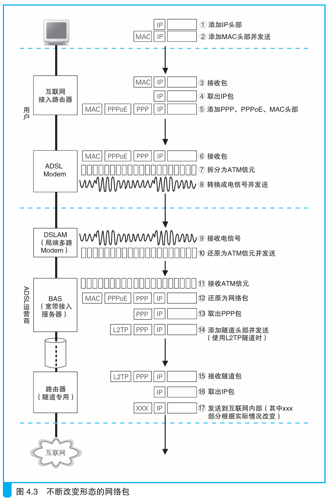

### ADSL Modem 将包拆分成信元

> 本节介绍：使用ADSL技术将网络包发到互联网，中间网络包要进行多次变换。

ADSL接入线路如图所示：

网络包被互联网接入路由器转发时，除了加上MAC头部外，还会加上PPoE头部，PPP头部，然后根据以太网的转发规则发给`ADSL Modem`。

`ADSL Modem`把包拆分成小包，每一个小包被称为一个信元，开头是5个字节的头部，后面是48个字节的数据，用于一种叫做ATM的技术。信元的拆分和TCP/IP将数据块拆分装包的原理是一样的。

> <i>ATM：Asynchronous Transfer Mode，异步传输。它是在以电话线为载体的传统电话技术基础上扩展出来的一种通信方式。它的数据传输是以“信元”为单位来进行的，这和以包为单位传输数据的TCP/IP很像，但这种方式并不适用于计算机通信。</i>

也有一些运营商的`ADSL Modem`不进行数据拆分。