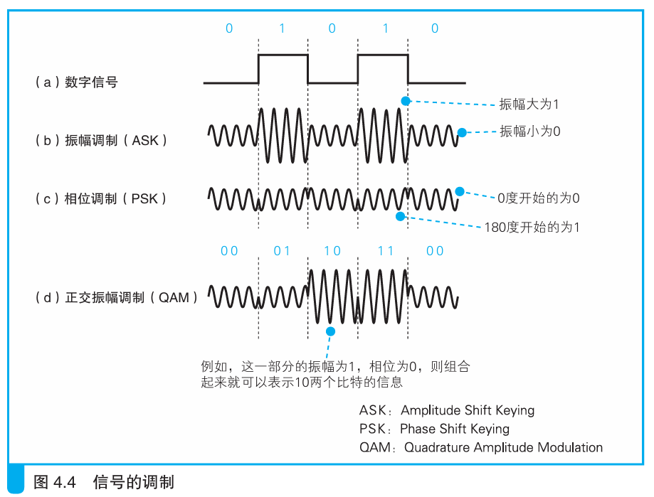
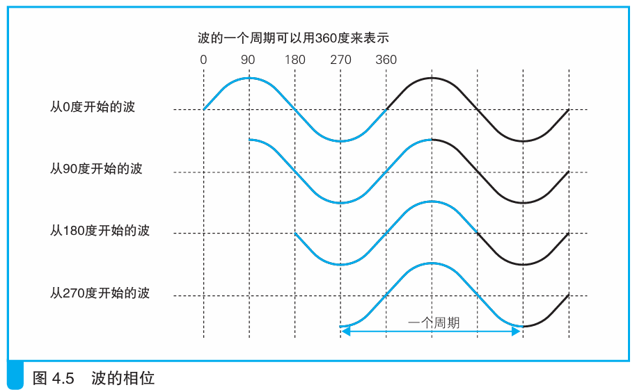

### ADSL 将信元“调制”成信号

> 本节介绍：信元被转换为正交波形的电信号，使用振幅和相位表示0和1。

以太网采用方形波来传递电信号，而ADSL采用的方法更复杂。这是因为方形波在长距离传输中波形更容易失真，错误率更高；另外方形波覆盖了从低频到高频的宽广频段，频段越高，辐射出的电磁波越强，越难以抑制噪音。

`ADSL Medom`采用圆滑波形（正弦波）对数字信息0和1进行合成，也就是调制。ADSL采用振幅调制（ASK）和相位调制（PSK）相结合的正交振幅调制（QAM）。

如上图b所示，振幅调制使用振幅大小来代表1和0，如果将振幅的大小分4级，就可以代表两位比特数。以此类推，振幅分级越多，一次性传输的比特数越多，但这样做会导致信号失真后容易识别错误。

如上图c所示，相位调制是使用相位来代表0和1，也就是圆的角度表示，比如用0度表示0，180度表示1。同样的，一次性用多个角度的话就可以表示多个二进制位，比如使用四个角度就能表达两个二进制位。缺点也很明显，角度之间接近的话就容易失真引发识别错误。

如上上图d所示，正交振幅调制就是两种调制的结合，一般情况下每种调制表示一个比特位，两个结合就能表示两个比特位，以此类推，分级越多，结合后表示的比特位越多，但过多分级也有识别错误的风险。