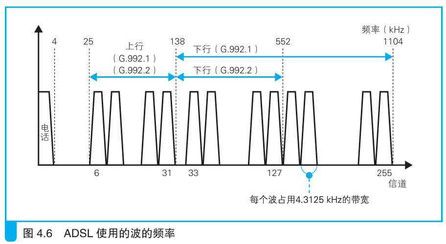

### ADSL 通过使用多个波来提高速率

> 本节介绍：正交振幅调制可以用一个波来表示一串数字信息，那么把多个波合成在一起，就可以一次性表示多串数字信息。提取时用滤波器过滤出来就可以。

不同频率的波可以合成，合成后又可以用滤波器分离特定频率的波。那就可以用频率合成的波传递信号，这样传输的比特数就能成倍提高。

如上图所示，ADSL使用间隔为4.3125kHz的多个波合成来传递信息。同时为了防止噪声的影响，对高频的波分配的较少的比特数，对低频的波分配较多的比特数。所有比特数加起来就决定了整体的传输速率。

ADSL技术中，上行方向（用户到互联网）如果使用26个频段，下行方向（互联网到用户）就可能使用95或者223个频段，这就导致了上行和下行方向上传输速率的不同。

每条线路上的噪声和衰减都受很多因素的影响，并且随时间变化。ADSL动态检查线路上的信号传输情况。`Medom`通电后，会往线路发送测试信号，根据测试信号的传输情况来调整信号的频段和比特数，这一过程称为训练（握手），持续几秒到几十秒。

