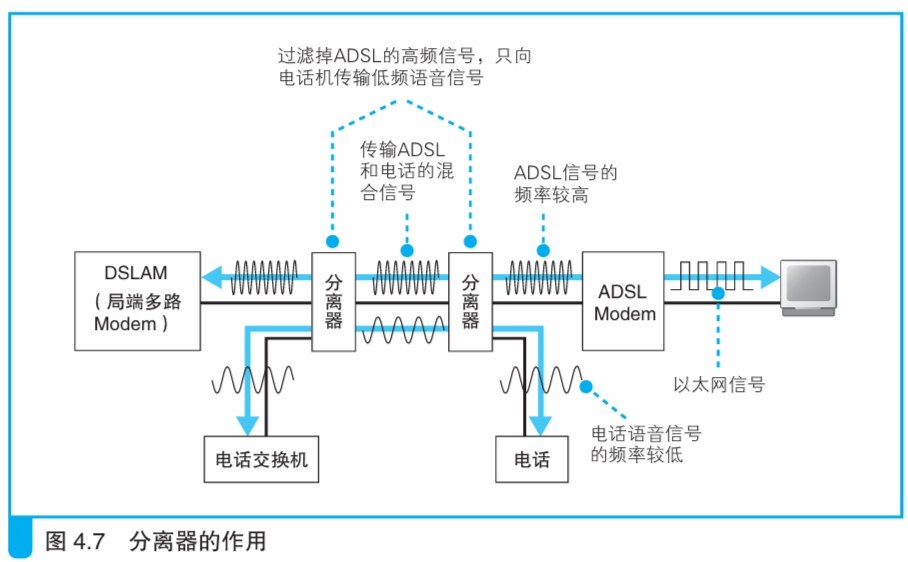

### 分离器的作用

> 本节介绍：在电话线中电话信号和ADSL信号是混合的，分离器负责在两种信号分别到达下一个目的地时将信号分离开。

`ADSL Modem`将信元转换为电信号，然后电信号和电话信号一起混在电话线中传输出去。此时信号虽然经过分离器，但分离器并不进行处理。

分离器是负责在信号传入时过滤信号。如下图所示，混合信号经过分离器时分为两组，一组是经过分离器过滤掉代表ADSL的高频信号后余下的电话信号进入电话机；另一组仍然是混合信号进入`ADSL Modem`，`ADSL Modem`内置了分离器的功能，可以直接过滤非ADSL的信号。

分离器除了过滤高频信号的功能外，还可以防止电话信号对ADSL信号产生影响。电话在接通时电话信号流通，断开时电话信号消失，这会对线路的噪声状况产生影响，此时为了保证信号传输，ADSL就要重新训练（握手），这就会产生几十秒的通信中断，分离器可以防止发生这种问题。

> G.992.2的ADSL可以实现快速握手，不会产生通信中断。但是为了确保电话信号不受干扰，仍然需要使用分离器。