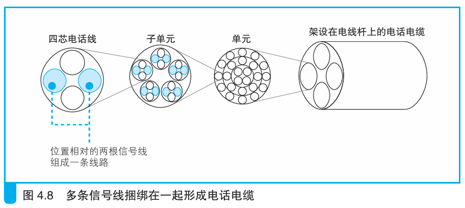

### 噪声的干扰

> 本节介绍：ADSL信号受到噪声干扰，会导致网络传输速率降低。

电话线使用金属材料制成的，因此传输信号时会受到外部噪声和内部噪声（串扰）的干扰，并且由于设计之初没有考虑传输ADSL信号这样的高频信号，所以其抑制噪声的能力远弱于以太网双绞线。

双绞线中传输一个方波信号，受到噪声干扰就会读取错误。而电话线中ADSL信号分布在多个频段，只有与噪声信号频率相同的信号受干扰，因此只要放弃受干扰的频段信号就能正确传输信息，但这会造成网络传输速率下降。

> 比如电车线路旁边，电车的受电弓（pantograph）从架空接触网获取电力时会产生电火花释放噪声，ADSL会因此受到干扰，导致速率下降。此外，ADSL还会受到AM电台广播的干扰。

电缆内部的噪声也会形成干扰，如图所示：

图中的四芯电话线内部，或者子单元附近如果同时存在ADSL和ISDN信号线就会产生干扰。

> 现在防ISDN干扰的技术已经成熟，可以忽略ISDN信号线对ADSL信号的影响。