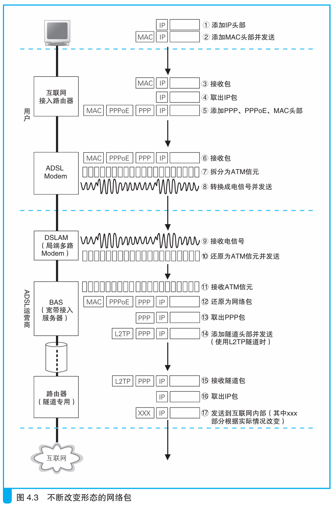

### 通过DSLAM到达BAS

> 本节介绍：电话局中的DSLAM接收来自用户端的信号，将其转换为ATM信元然后发给BAS，BAS再将其中的IP包转发到互联网。

如图所示：

信号经过电话线来到电话局，通过配线盘、分离器后到了DSLAM，在这里被还原为信元。

> DSLAM还原电信号为信元的操作与`ADSL Modem`是一样的，只是其处理容量大了很多，可以将其理解为把多个`ADSL Modem`放在一个外壳中。
>
> 但应注意DSLAM不像`ADSL Modem`那样使用以太网接口，DSLAM一般使用ATM接口，收发数据都是采用ATM信元的形式。
>
> 也有一些DSLAM是不将网络包拆分成ATM信元的，而是直接以网络包的状态转换成ADSL信号，这样的DSLAM在和后方路由器收发数据时也是使用包的形式。
>
> <i>DSLAM：DSL Access Multiplexer，数字用户线接入复用设备。它是一种电话局用的多路ADSL Modem，可以理解为将多个ADSL Modem整合在一个外壳里的设备。</i>

在上图中，DSLAM将信元交给BAS。BAS将信元还原为网络包，通过MAC头部和PPPoE头部的信息将包递给相应的接口，然后丢弃MAC头部和PPPoE头部。接着BAS给PPP包添加对应的隧道专用头部，然后将网络包交给隧道的出口。

然后网络包到达隧道出口的隧道专用路由器，在这里隧道头部被去掉，IP包被转发到互联网。

