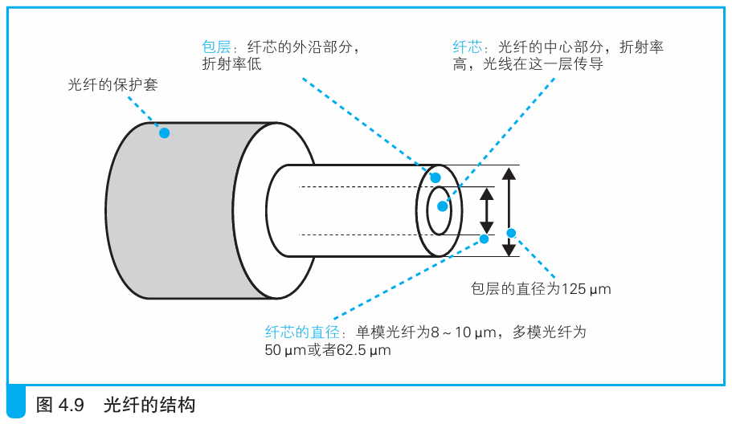
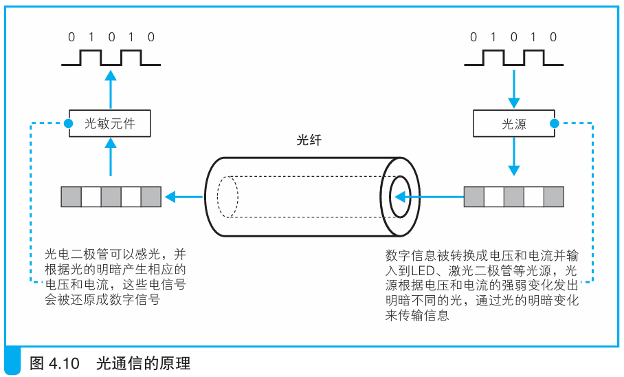

### 光纤的基本知识

> 本节介绍：电信号通过光敏元件转换为光信号，光信号在光纤中传输，到另一端再由光敏元件转换为电信号。

`FTTH`是基于光纤的接入网技术。

光纤是由双层结构的纤维状透明材料（玻璃或塑料）构成的，里面的纤芯传导光信号。光信号亮表示1，暗表示0。如下图所示：

光纤通信时，发送端将数字信息转换为电信号，电信号中的高电压经过LED，激光二极管等器件时发亮光，低电压则发暗光。这样的光信号到达接收端时，亮光遇光敏元件发出高电压，暗光遇光敏元件发出低电压。如下图所示：

