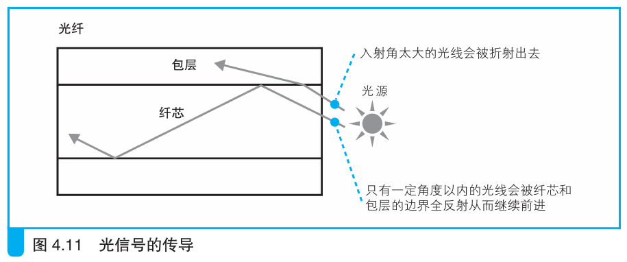
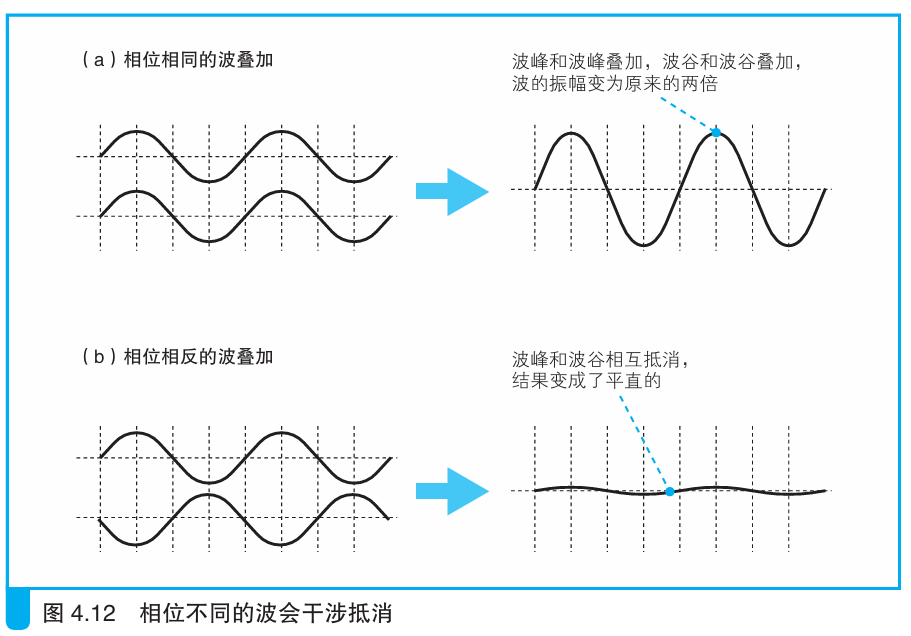
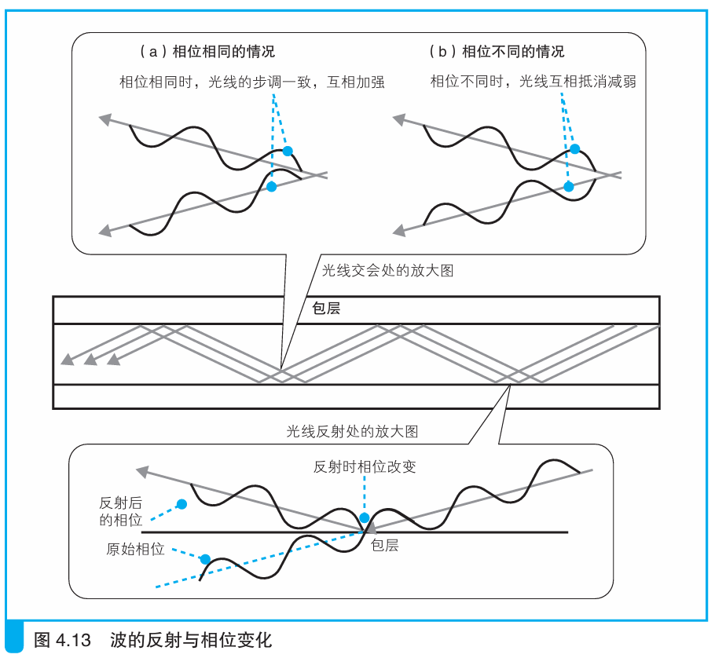
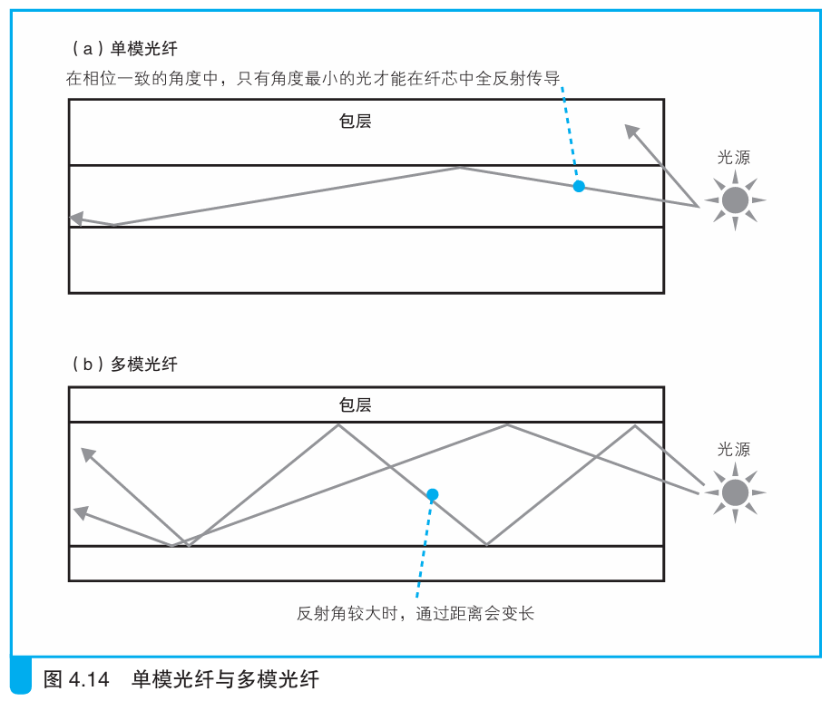
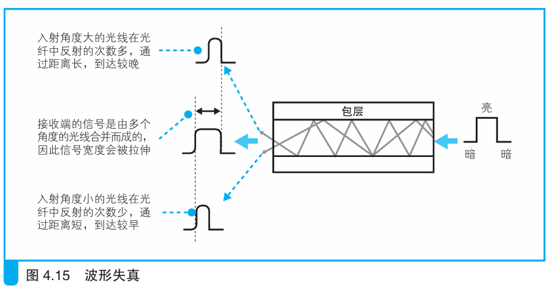

### 单模与多模

> 本节介绍：从光纤纤芯直径可以划分单模和多模光纤，其中单模传输效率和速率更高但是贵，多模效率低但是便宜。
>
> **温馨提示：本节图片中存在翻译问题，入射角和反射角的大小与图中描述刚好相反**

光信号传导受光纤材质和形状的影响。不同材质光纤折射率和透光率不同；纤芯的直径大小对光的传导影响很大。

---

*首先来看看光是如何在光纤中传输的*

光源在所有发向上都会发光，但入射角度太小的光线会发生折射，只有入射角度大于临界角度才会发生全反射从而在纤芯中向前传输。如图：

不过并不是发生全反射就能一直传输，光具有波粒二象性，如果反射的光波和入射的光波相位相反就会发生干涉从而互相抵消，如下图所示：

最终只有少数特定角度可以全反射的同时保证相位一致，从而一直传导下去。

---

通过入射光的角度可以决定纤芯的直径。根据纤芯直径大致可以划分单模纤芯和多模纤芯。单模纤芯直径小（8～10 μm），只能容纳相位相同的光线中入射角最大的那一个；多模纤芯直径大（50 μm 或62.5 μm），可以容纳多个相位相同的光线。

单模和多模性质不同也导致了相应的材料价格不同。单模对光线的要求严格，也就对光源和光敏元件的性能要求高，导致所需光源和光敏元件价格高；多模允许多种光线通过，所需光源和光敏元件的价格低。

光信号在光纤中传输时，入射角大的往往反射次数小，走过的距离就短，从而到达另一端的时间短，而入射角小的则相反。多模光纤因为允许多道光线传输，不同光线有不同的入射角，最后到达另一端的时间就不一致，这就导致信号宽度拉伸，从而造成信号失真，尤其是光纤长度超出一定限度，就会通信错误。

单模光纤由于传输单一光线，因此光纤长度再长也很难失真。

单模光纤传输效率高、速率高、成本高，多模光纤传输效率低、速率低、成本低，所以多模光纤往往用于建筑物内连接，单模则用于建筑之间连接。`FTTH`用的就是单模光纤。