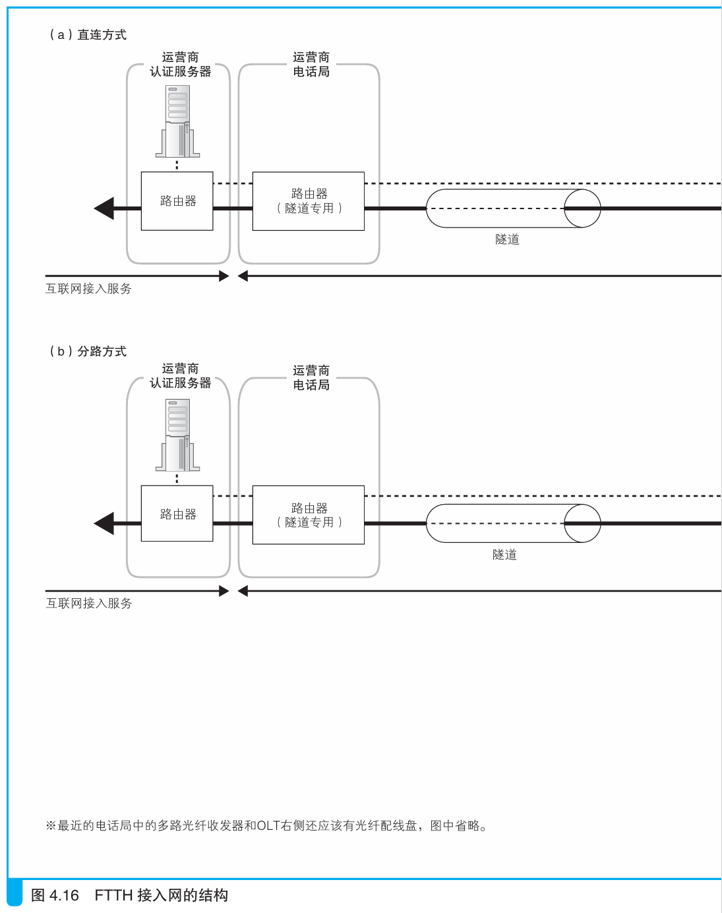

### 通过光纤分路来降低成本

> 本节介绍：`FTTH`使用光纤来传递网络包给运营商，分两种方式。一种是直接将光纤连接在电话局，另一种是将多个用户的光纤整合在分光器上，再由分光器发给电话局。

`FTTH`可以使用光纤代替ADSL方式中的电话线来连接用户的互联网接入路由器和电话局的BAS。从形态上分两种。

> <i>FTTH和ADSL一样也有不同的衍生规格，主流规格是和ADSL一样采用PPPoE 方式进行接入，后面我们的介绍也是基于PPPoE方式。</i>

---

第一种是将用户的互联网接入路由器直接连接上电话局，如下图a所示：

互联网接入路由器将MAC包交给光纤收发器，光纤收发器将电信号直接转换为光信号，光信号通过光纤传到多路光纤收发器，多路光纤收发器再将光信号转换为电信号，然后交给BAS，BAS再将其转发到互联网。

服务器返回的光信号也在同一条光纤中传输，为防止混合，下行光波和上行光波的波长不同，这样可以用棱镜原理进行分离。这种不同波长光波在同一条光纤中传输的方式就叫波分复用。

---

第二种方式是在用户居住附近的电线杆上安装一个分光器，分光器让光纤分路，同时连接多个用户，如上图b所示。

> <i>通过光纤分路连接多个用户的光纤接入模式统称为PON（Passive Optical Network，无源光网络），可分为GE-PON、WDM-PON、B-PON、G-PON等多种方式，现在大多使用最高速率为1 Gbit/s的GE-PON方式。</i>

用户端使用叫做ONU的设备，该设备转换电信号为光信号，然后发给BAS前叫做OLT的设备。

> <i>ONU：Optical Network Unit，光网络单元。它和光纤收发器一样，可以将电信号转换成光信号，除此之外还具有和电话局的OLT相互配合避免信号碰撞的功能。这个设备有时也被叫作终端盒，因此终端盒这个词本身是对光纤收发器和ONU等光纤终端设备的统称。</i>
>
> <i>OLT：Optical Line Terminal，光线路终端。</i>

发送信号时为了防止多个用户的信号在分光器中碰撞，OLT会调整每个信号的发送时机并给ONU下指令，ONU则根据指令发送信号。

接收信号时不会发生碰撞，但分光器会把信号发给所有设备，为了防止信息泄露，每个包前都会加ONU识别信息，ONU只会接收自己的包，对于其余的包直接丢弃。

---

直连和分路两种方式只在形式上不同，具体的网络包是一样的。当使用PPPoE传输网络包时，方式与ADSL相似，只是中间的电信号换成了光信号，并且不加信元，其余关于加PPP头部、PPPoE头部、MAC头部等过程都相同。

