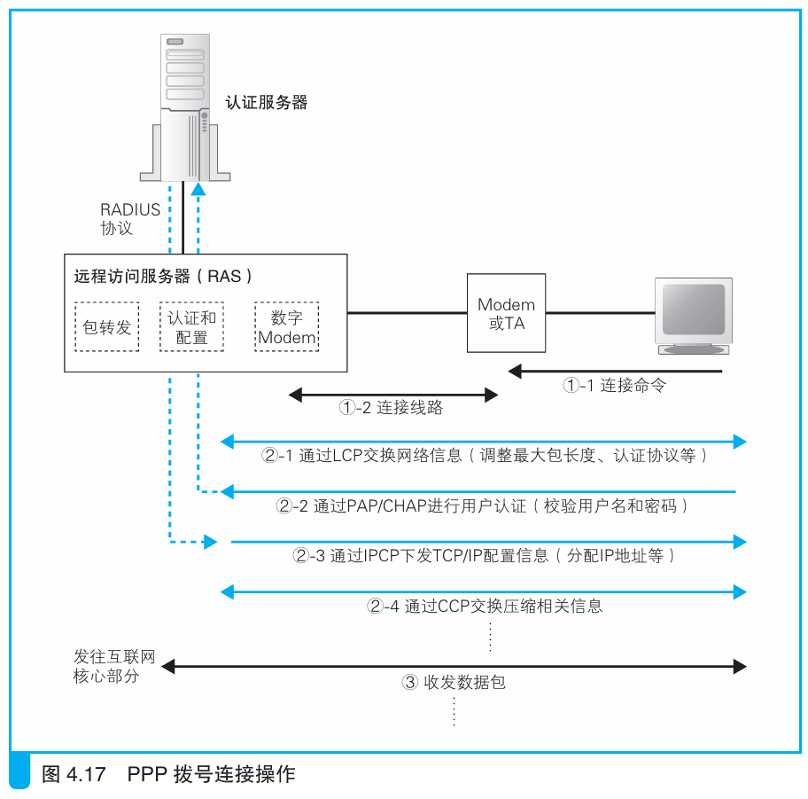

### 用户认证和配置下发

> 本节介绍：在使用ADSL或FTTH正式在互联网上收发消息之前，需要先和运营商完成一系列操作，其中包括用户信息认证，IP地址等配置下发等。

BAS是一种进化型的路由器，ADSL和FTTH接入网都连接在BAS上。用户上网前需要先输入账号和密码进行登录，BAS就是登陆的窗口，登陆操作通过PPPoE（<i>Point-to-Point Protocol over Ethernet，以太网的点对点协议。</i>）方式实现。

PPPoE由PPP方式演变而来，下面我们先介绍PPP方式。

---

###### PPP拨号上网方式

在使用电话线或ISDN拨号上网时，PPP如下图方式工作：

工作流程：
1. 用户向运营商接入点拨打电话；
2. 电话接通后，输入用户名和密码进行登录；
3. 用户名和密码通过`RADIUS`协议从RAS发送到认证服务器，认证服务器检验信息是否正确；
4. 确认后，认证服务器返回IP地址等配置信息，并将其下发给用户；
5. 用户根据配置信息完成TCP/IP收发网络包的参数准备。

> 由于拨号上网时不同电话号码的接入点有不同的IP地址，所以分配的公有地址不是一开始就决定好的。

---

