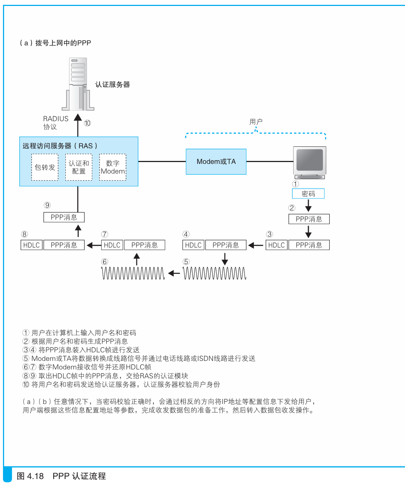
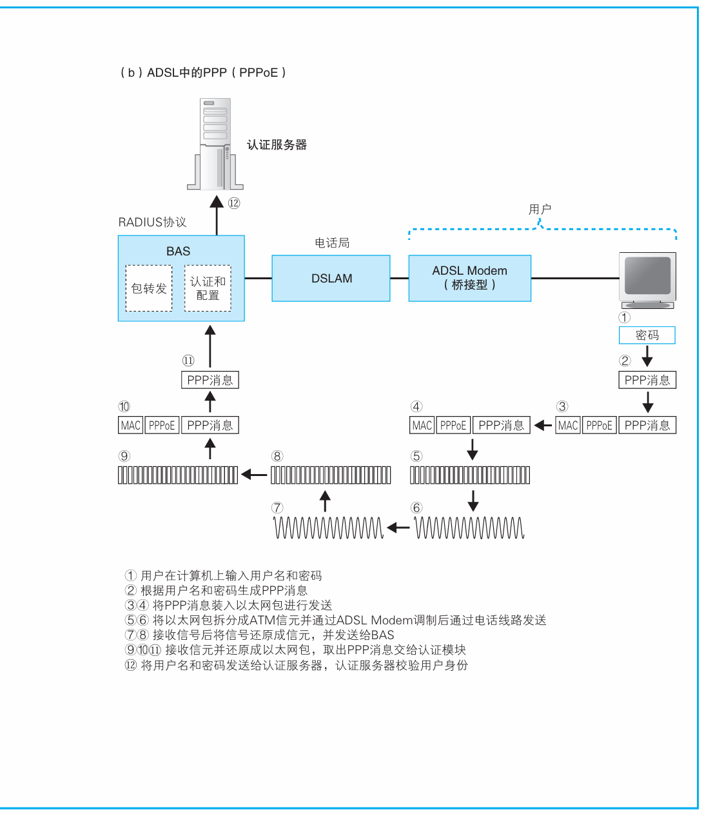
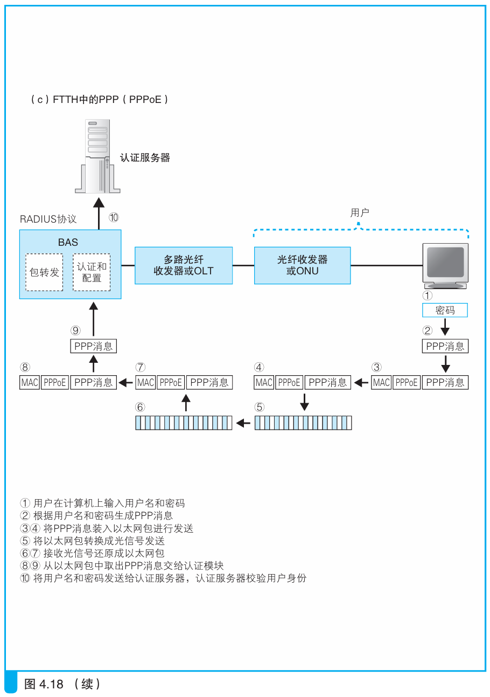

### 在以太网上传输PPP消息

> 本节介绍：ADSL和FTTH不能像PPP方式那样发送消息，于是出现了PPPoE来帮助ADSL和FTTH发送消息进行认证。

ADSL和FTTH也使用PPP消息来进行认证和分配配置信息。进行认证是为了通过输入不同账号好切换运营商，分配配置信息则是因为接入网也需要IP地址进行上网。

> <i>也有一些运营商不使用PPP，而是使用DHCP方式来向客户端下发IP地址等配置信息。</i>

---

###### PPP协议传输消息

PPP协议没有为PPP消息提供报头、FCS、信号格式，PPP消息借用HDLC协议作为容器。原本的HDLC协议用于专线上发送网络包，拨号上网对其进行了一些修改。如图所示：

---

ADSL和FTTH不能使用HDLC协议，于是使用以太网包来传递PPP消息，为了修正PPP消息和以太网消息之间的不同，出现了PPPoE格式，如下图所示：

