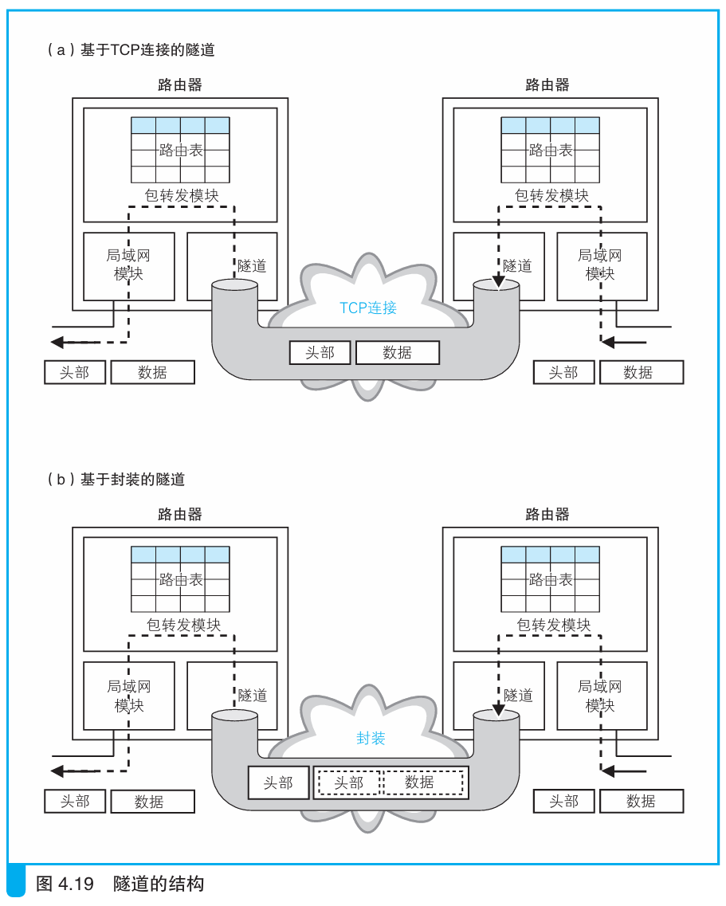

### 通过隧道将网络包发送给运营商

> 本节介绍：BAS和运营商的接入网路由器之间连通一条隧道，通过隧道原封不动地传输网络包。隧道可以用套接字实现，也可以再加一个头部来实现。

BAS可以使用隧道传输网络包，从隧道一头放入网络包，网络包原封不动从另一头出来。

在BAS和运营商路由器之间的ADSL/FTTH接入服务商的网络中创建一条隧道，相当于将用户和运营商路由器连接起来，用户的网络包通过这条通道发到互联网。

隧道的创建可以仿照TCP连接。在路由器中创建套接字，并将该套接字作为路由器的一个端口，使用隧道专用的规则在套接字中放入网络包，就可以传输消息。如下图a所示：

上图b中还介绍了一种方式，那就是把网络包再放入一个新包中，新的头部就是隧道专用头部，这样也可以进行网络包的传输。

