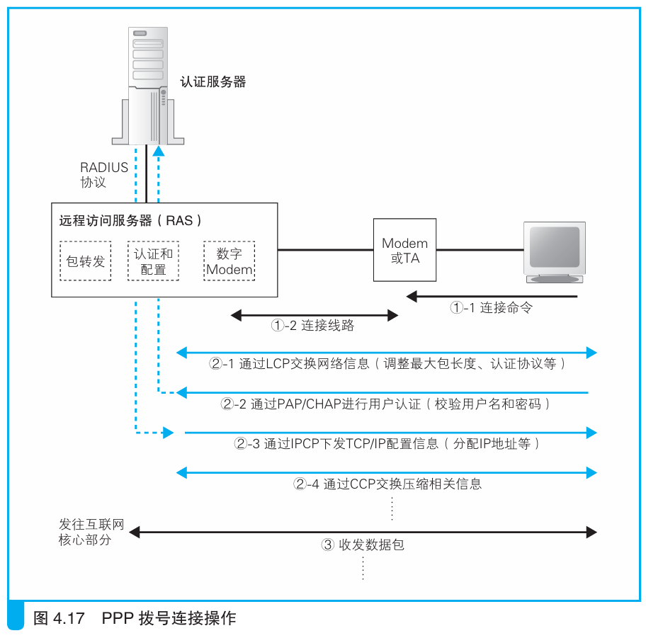

### 接入网的整体工作过程

> 本节介绍：接入网首先进行认证和配置，完成后就将网络包从接入网路由器发出去送到BAS，BAS送到运营商路由器，运营商路由器再向下一个目标转发，最后送到目的地。

接入网一开始工作时，互联网接入路由器首先配置运营商分配的用户名和密码，然后通过PPPoE发现机制，也就是基于广播找到BAS的MAC地址，相当于下图中1-1和1-2过程：

> <i>如果不使用路由器而是从计算机直接上网的情况下，需要在计算机中配置用户名和密码，这时计算机会代替路由器完成PPPoE操作，实际上这才是最初的原始方式。</i>

找到BAS后开始发送用户名和密码，如图4.17过程2-1和2-2所示，可以选择对密码加密或者不加密的方式。加密采用CHAP（<i>Challenge Handshake Authentication Protocol，挑战握手认证协议</i>）方式，安全性高。不加密就采用PAP（<i>Password Authentication Protocol，密码验证协议</i>）方式，这种方式下除非在路由器和`ADSL Modem`之间窃听，或者在电缆上拾取电磁波，否则没有被窃取的可能；当然如果能使用光纤，那就连电磁波都不会泄露了。

> 从BAS向认证服务器发送密码时使用RADIUS协议，无论用户拨入使用CHAP还是PAP，RADIUS都是加密的。

BAS完成密码验证后下发设备IP地址，DNS服务器IP地址，默认网关IP地址。其中设备IP分配到路由器的BAS端口上，默认网关IP写入路由表。

接下来就可以输入网址发送消息了。一般访问地址都不会在互联网接入路由器的路由表中，这时路由器会发给默认网关的地址，也就是BAS的IP地址，采用PPPoE协议。路由器给PPP消息加上PPPoE头部和MAC头部，MAC头部的MAC类型就是PPPoE类型的8864H，接收方是BAS的MAC地址，发送方是路由器BAS端口的MAC地址。

BAS会去掉收到的包的MAC头部和PPPoE头部，然后通过隧道机制把PPP消息发给运营商路由器。

