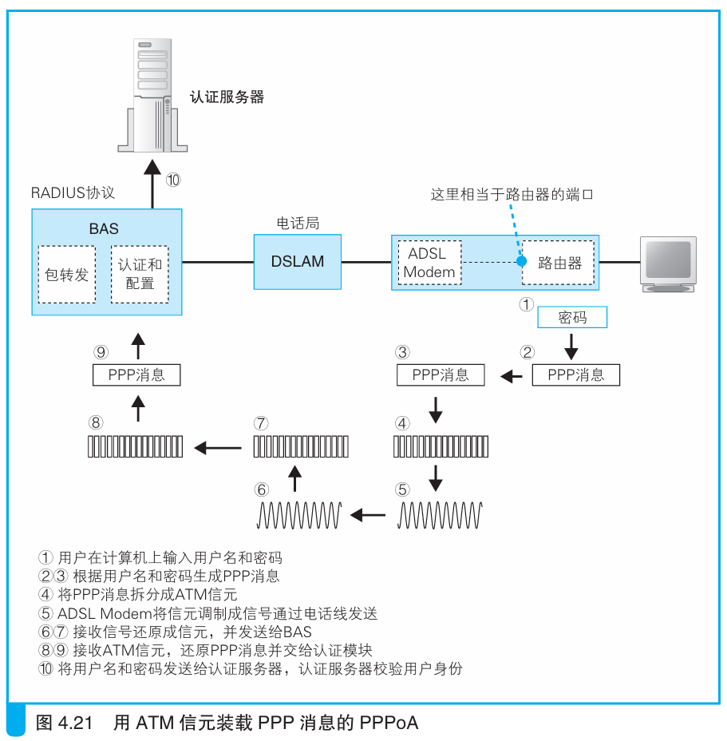
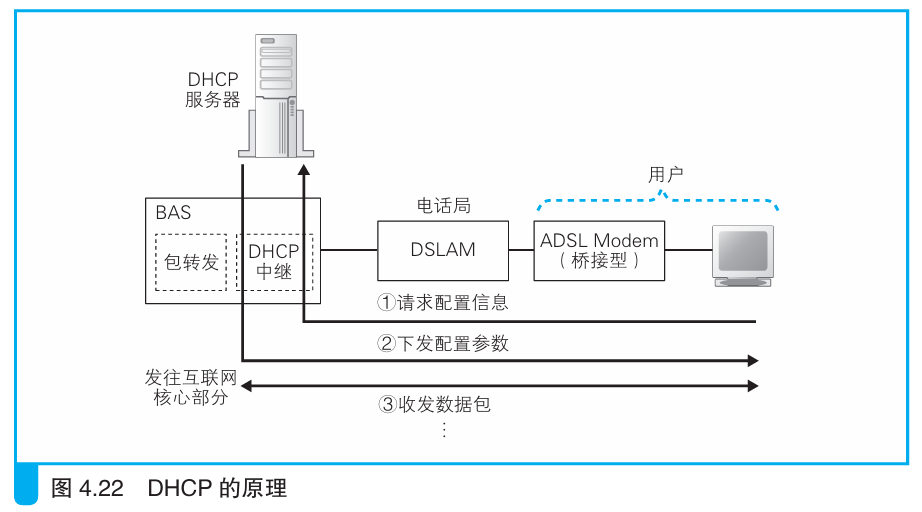

### 除 PPPoE 之外的其他方式

> 本节介绍：PPPoA可以直接收发PPP消息而不加PPPoE头部和MAC头部；DHCP可以直接发送以太网包而不需要信元，是按照以太网规则收发消息的。

PPPoA方式直接把PPP消息装入信元，其它过程与PPPoE没有区别。

由于PPPoA方式没有MAC头部，所以不能用以太网收发消息，需要把计算机和路由器与`ADSL Modem`合为一体。一体化方式有两种。

第一种是用USB接口把计算机和`ADSL Modem`连接，这种方式没有普及。

第二种方式是把路由器和`ADSL Modem`整合在一起，这样和PPPoE上网就没有什么区别。不过这种方式下那些因地址转换出错的程序就不能运行，因为PPPoA不适用以太网，所以计算机的PPP消息不能直接通过以太网送到`ADSL Modem`。

PPPoA相比于PPPoE是有一些优势的，因为不加PPPoE头部和MAC头部，所以PPPoA的MSS更大，也就是网络包容量更大，这样网络传输效率就更高了。

---

由PPP衍生出来的PPPoA和PPPoE都有一些缺点，所以有的运营商不使用PPP协议，而是DHCP协议。

DHCP经常用于公司网络向客户端下发TCP/IP配置。如下图所示：

DHCP可以直接请求配置而不需要用户名和密码，但也因此不能切换运营商。DHCP采用MAC收发信息，所有没有PPP头部和PPPoE头部，占用MTU小，网络传输效率高。

另外DHCP的`ADSL Modem`不使用信元，而是直接把MAC包转换为ADSL信号。

