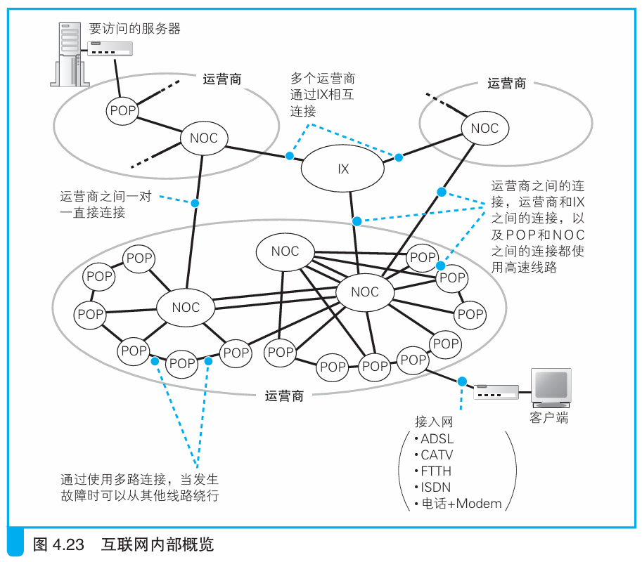
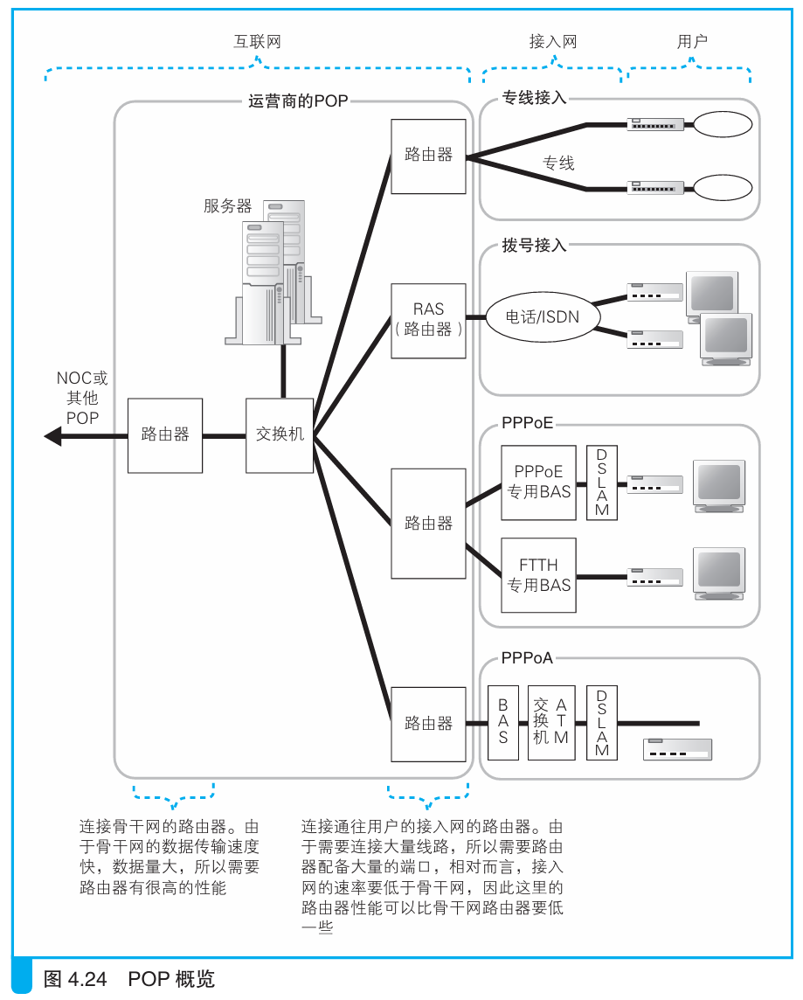

### POP 和 NOC

> 本节介绍：网络包经过接入网后到达POP的一个路由器上，也就是运营商的路由器，然后从这里被POP转发到互联网，过程中经过多个POP和NOC后到达目的地。

网络包从用户端发出，经过接入网后达到运营商的路由器，然后从这里进入互联网。

互联网由很多运营商的网络共同组成，用户的接入网连接的设备就是POP（<i>Point of Presense，中文一般叫作“接入点”</i>），多个POP又会连接在一个NOC上。

POP的内部根据各种不同的接入网装入了各种类型的路由器。

> 这里对上图中的不同线路作简要说明：
> 1. 专线不需要认证和配置，只需要一般路由器。专线是固定连接线路，不需要进行身份认证，参数是根据传真、书面等方式下发后进行手动配置的，因此也不需要PPP、DHCP等机制。其实，这就是最古老的互联网接入方式。
> 2. 电话/ISDN采用拨号上网，使用的路由器叫RAS。RAS可以对拨号行为进行应答，也可以使用PPP协议进行认证和配置下发。
> 3. PPPoE使用BAS，运营商路由器只负责转发，所以这里也使用一般路由器。
> 4. 在PPPoA协议中，`ADSL Modem`把PPP消息装入信元，然后转换为电信号发给DSLAM，DSLAM把电信号转换为信元，然后信元发给ATM交换机，ATM交换机把信元发给BAS，BAS还原网络包然后发给路由器。
>
> 　ATM交换机是转发ATM信元的设备，负责将DSLAM输出的信元转发给BAS。

连接接入网的路由器端口多，转发包数量少，所以性能不高，价格便宜。而连接NOC或其它POP的路由器吞吐量大，所以对性能要求高，价格贵。

NOC（<i>Network Operation Center，网络运行中心</i>）是运营商的核心设备，POP的包都被转发到这里，然后NOC再将其转发到离目的地最近的POP或者其他运营商的NOC。对性能要求高，采用的路由器也很贵。

一般面向个人的路由器吞吐量为100Mbit/s，面向运营商的路由器吞吐量为1Tbit/s。运营商的NOC和POP所用的路由器性能差不多，只是NOC的规模要大于POP。

> 实际上POP 和NOC中的设备不只有路由器。因为运营商还会提供如网站、邮件等各种服务，所以机房里面还会配备各种服务器。