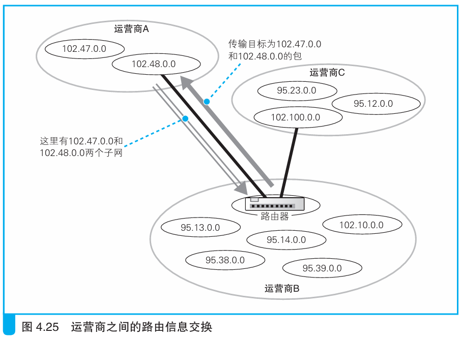
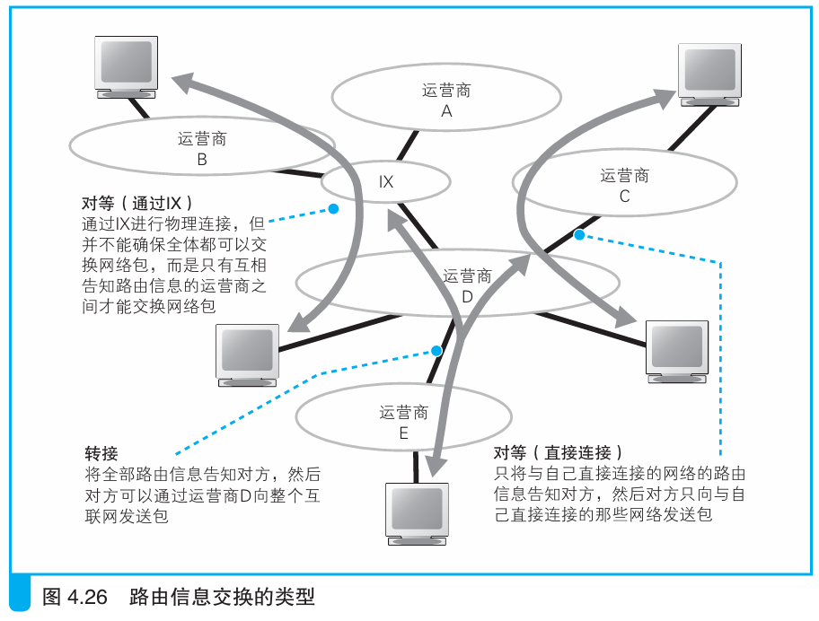

### 运营商之间的路由信息交换

> 本节介绍：路由器使用BGP机制自动交换路由信息。

路由器之间会交换各自所连接网络的信息，然后将信息写入到自己的路由表中。这个过程是自动进行的，使用的机制称为BGP（<i>Border Gateway Protocol，边界网关协议</i>）。

路由信息交换分两类。第一种是把自己连接的所有路由告知对方，如下图所示，D告诉E自己连接的所有网络，E就可以把网络包通过D发给每一个运营商：

这种通过D转发包的方式称为转接。

第二种是两个路由器之间只交换自己网络的信息，这样网络包只在两个网络之间接收，这种方式称为非转接，也叫对等。

> <i>对等的英文是peer，BGP规格中将互相交换路由信息的节点都称为peer，但BGP的peer实际上包含了转接和非转接两种节点，但“对等”的peer仅包括非转接的节点，它们的意思不同，请不要混淆。</i>

