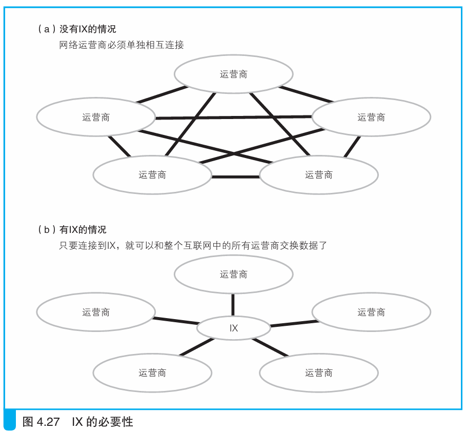

### IX 的必要性

> 本节介绍：IX是运营商之间连接的中间设备，有了IX，运营商就无需一对一连接了，其作用有点类似于交换机。

时至今日，运营商的数量早已多达数千家（至少在日本是这样的），运营商之间如果采用直接连接的方式，那就会非常麻烦，这个时候就需要一种中间设备，如下图所示：

这个中间设备就叫IX。

> 现在日本国内有几个这样的设备，其中具有代表性的包括JPIXB、NSPIXP-2C、 JPNAPD。经过这 3个IX的数据总量约为200 Gbit/sE，而且还在持续增加。