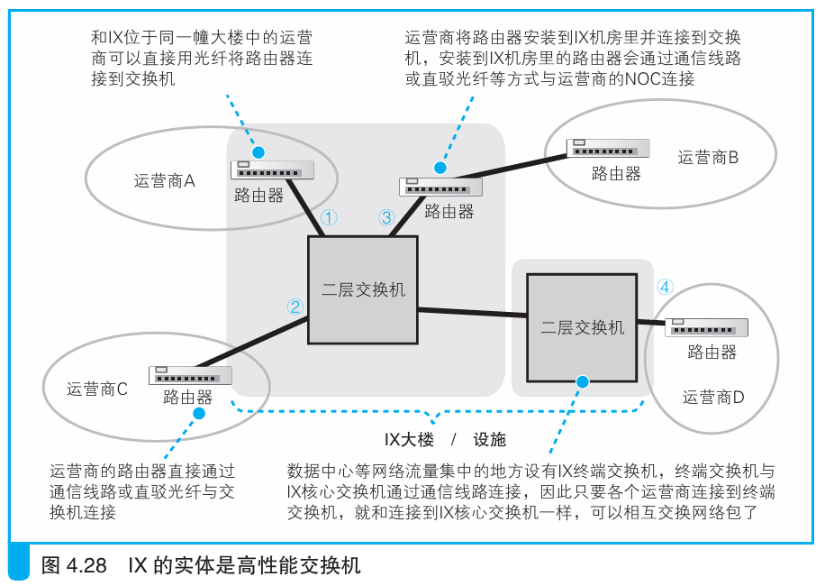

### 运营商如何通过IX互相连接

> 本节介绍：IX放在安全性高的大楼里，很多NOC路由器或者POP路由器或直接连接，或通过通信线路连接。

像IX，NOC这一类的都是高性能的网络转发设备，在网络传输中有重要作用，所以都存放在安全性高的大楼中，防震防断电。

IX的核心是有大量高速以太网端口的二层交换机，可以理解为大型高性能交换机。

> 现在使用的是10 Gbit/s端口，如果将来出现更高速的以太网标准，在数据量大的地方应该就会升级到更高速的设备。
>
> 这种方式称为“二层方式”，在日本是主流方式，当然，也有采用其他方式的IX。

---

> 运营商路由器和IX的连接分三种：
>
> 1. IX和NOC在同一栋大楼，这种情况下直接延申路由器光纤到IX；
> 2. IX和NOC不在一栋大楼，把路由器安装在大楼，路由器和IX用光纤连接，和NOC用通信线路连接；
> 3. IX和NOC不在一栋大楼，用通信线路连接路由器和IX。

过去IX都放在一个地方，现在由于网络流量越来越大，如数据中心等网络流量集中的地方都有IX终端交换机。

IX在传输网络包时仍然遵循一般交换机的规则，只是多了一项运营商认证，只有对交了钱的运营商才能转发网络包。