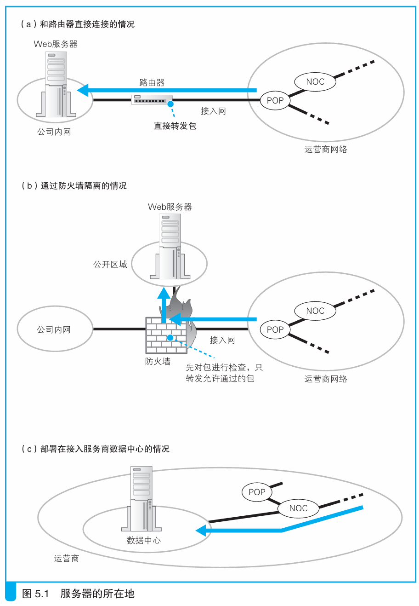

### 将 Web服务器部署在数据中心

> 本节介绍：数据中心有很好的安全性，并且提供了防火墙，高速路由等附加服务，相比起把服务器放在公司，放在数据中心是一个很不错的选择。

Web服务器不仅可以放在公司，也可以放在运营商的数据中心，或者直接租用运营商数据中心的服务器。如下图c所示：

数据中心一般与运营商的核心NOC直接连接，或者跟IX直接连接，把服务器放在这里可以获得很高的数据传输效率，对于访问量大的服务器尤其如此。

> <i>如果将服务器部署在公司里时，只要提高接入网的带宽，就可以让访问速度变得更快。</i>

数据中心的安全性也很高，一般都在抗震的大楼，并且提供发电设备，还有24小时门禁。另外，数据中心还提供防火墙、服务器工作状态监控、非法入侵监控等服务。

如果服务器部署在数据中心，网络包会先经过互联网核心（比如NOC）到达数据中心，然后从数据中心到达服务器。