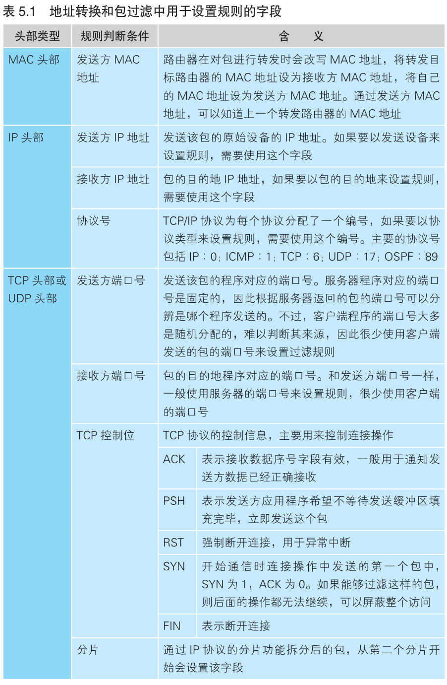
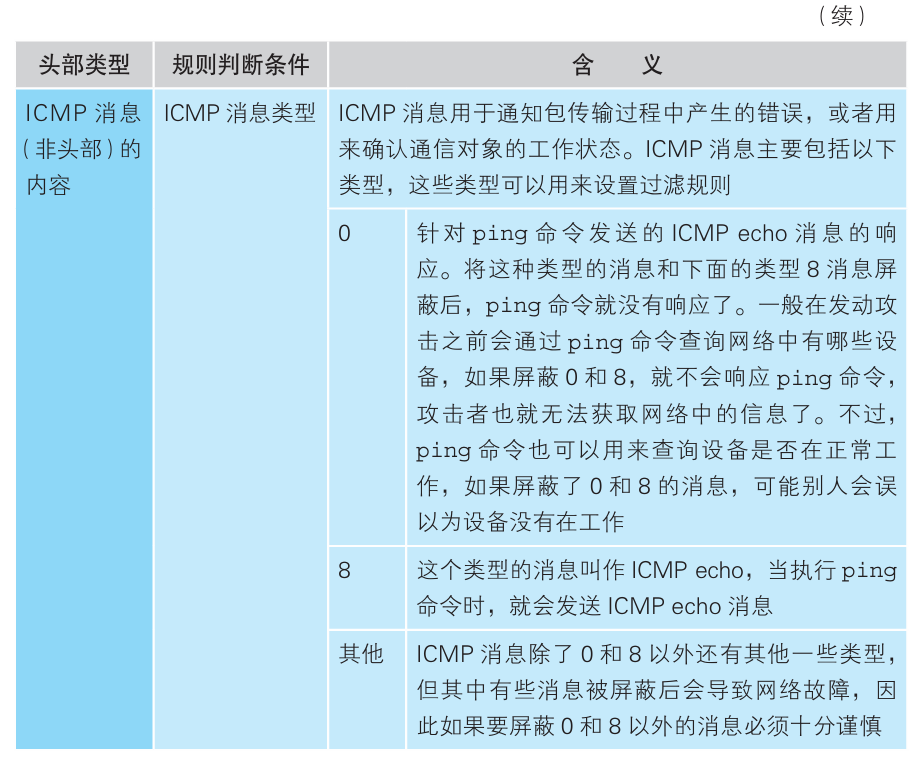
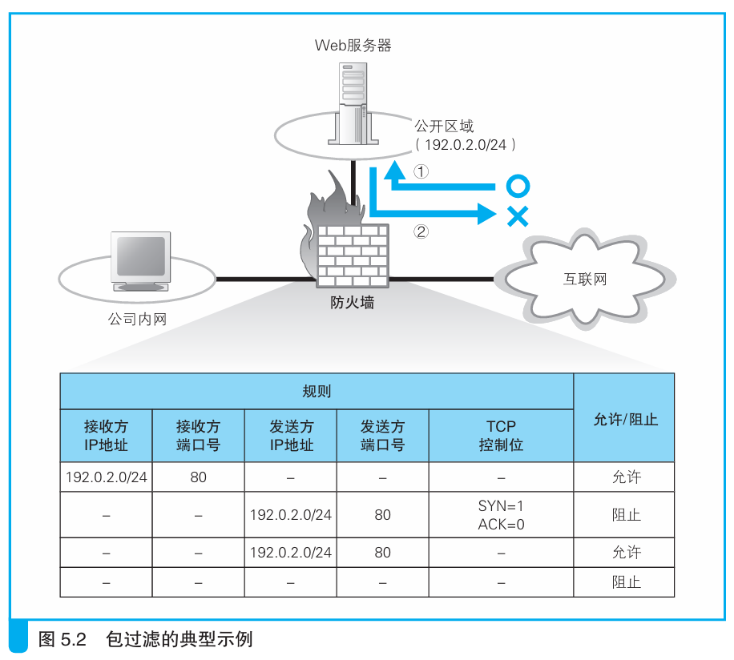

### 如何设置包过滤的规则

> 本节介绍：网络包的头部包含控制信息，防火墙通过检查控制信息来判断是否要对网络包屏蔽。

网络包的头部包含很多控制信息，从控制信息中可以得知该网络包的流向和作用。通过设置防火墙中对特定字段的规则，就可以实现包过滤。一般包过滤规则所设置的字段如下：

---

下面来举例说明：

上图中的Web服务器部署在公司内网外，与互联网可以直接通信。该服务器内包含一个感染服务器的恶意软件，要阻止服务器中的恶意软件程序传到其它服务器上。

该服务器不能向互联网中发送请求，但是别人可以向它发送，因此在包过滤规则中可以设置允许任意发送方IP，但接收方IP必须为服务器的网络包通过（上图第一行）。

服务器收到请求消息后需要返回响应包，那么就可以设置发送方IP为服务器，且TCP中响应控制位为1的网络包通过（上图第三行）。