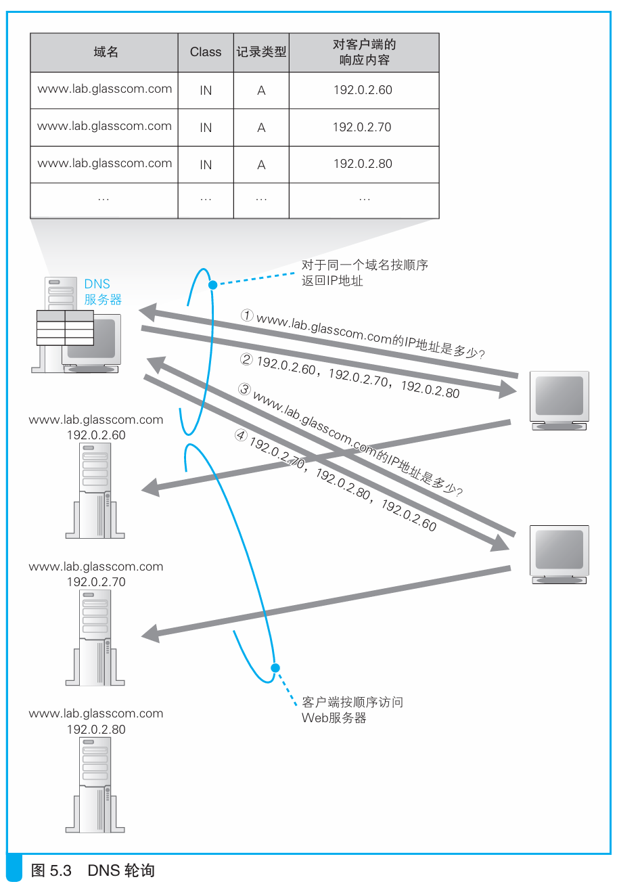

### 性能不足时需要负载均衡

本节介绍：当服务器的访问量过大时，会出现程序处理不过来的情况，这时候可以使用多台服务器来处理请求，从而分担服务器的负载，也就是分布式服务。

在服务器访问量大的情况下，可以通过增加线路带宽提升网速，但传输网络包过多时，服务器性能跟不上，尤其是需要CGI程序动态处理数据，会对服务器CPU造成很大负担。

使用分布式架构，让多台服务器提供网络服务可以解决负担较大的问题。这种架构下需要一种机制将请求分配给不同的服务器，最简单的方式就是DNS服务器来分配。

事先在DNS服务器中填写多个域名相同的记录，每次查询时按顺序返回不同的IP地址，比如对于域名`www.lab.glasscom.com`，如果我们给它分配如下3个IP地址：

> 192.0.2.60
> 192.0.2.70
> 192.0.2.80

当第1次查询这个域名时，服务器会返回如下内容。
> 192.0.2.60 192.0.2.70 192.0.2.80

当第2次查询时，服务器会返回如下内容。
> 192.0.2.70 192.0.2.80 192.0.2.60

当第3次查询时，服务器会返回如下内容。
> 192.0.2.80 192.0.2.60 192.0.2.70

第四次查询时返回结果就和第一次一样了。这种方式称为轮询。

轮询方式也有缺点，DNS服务器并不知道Web服务器的状态，即便有一台Web服务器产生故障，DNS服务器也会照常返回其IP地址。

此外，轮询方式也可能导致某些连续的操作无法完成。比如CGI动态处理页面，在第一个页面输入姓名地址，第二个页面输入银行卡号，如果负责这两个页面的服务器不同，那么两个服务器都会认为信息缺失。