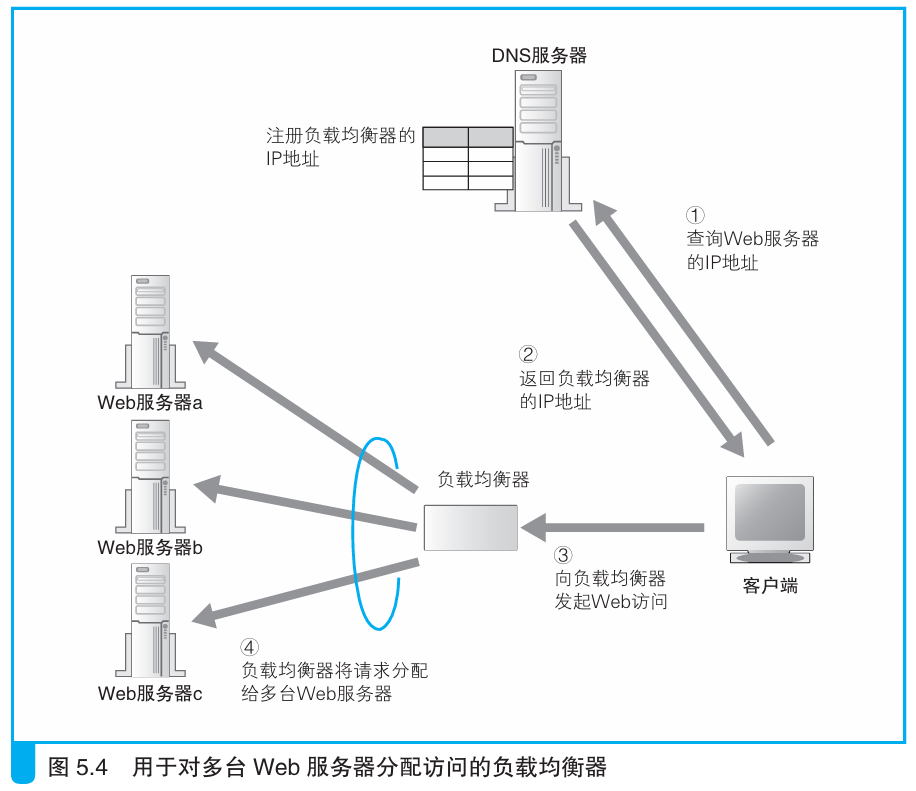

### 使用负载均衡器分配访问

> 本节介绍：使用负载均衡器来分配请求消息，负载均衡器会判断服务器的负载情况以及是否有翻页处理的请求。

为了避免轮询方式出现的问题，在DNS服务器中使用负载均衡器的IP地址代替Web服务器的IP地址。客户端把消息发给负载均衡器，再由负载均衡器决定将消息发给哪个服务器。

负载均衡器可以根据是否翻页以及服务器负载情况判断将包发给哪个服务器。

当不需要翻页处理时，负载均衡器判断服务器负载情况发包，判断方式大致分为三种：

> 1. 负载均衡器定期采集服务器CPU、内存使用率；
>
> 2. 负载均衡器向服务器发测试包，根据服务器返回响应的速度判断服务器负载；
> 
> 3. 提前在设置好每台服务器的性能指数，根据比例分配请求。

当出现跨页操作时，则不考虑服务器负载，而是将所有连续的请求发到同一台服务器上。

> 扩展后的HTTP规格的头部中有判断多次TCP连接之间相关性的字段信息，这种信息俗称Cookie。当然也可以在包的内容中注明相关性。