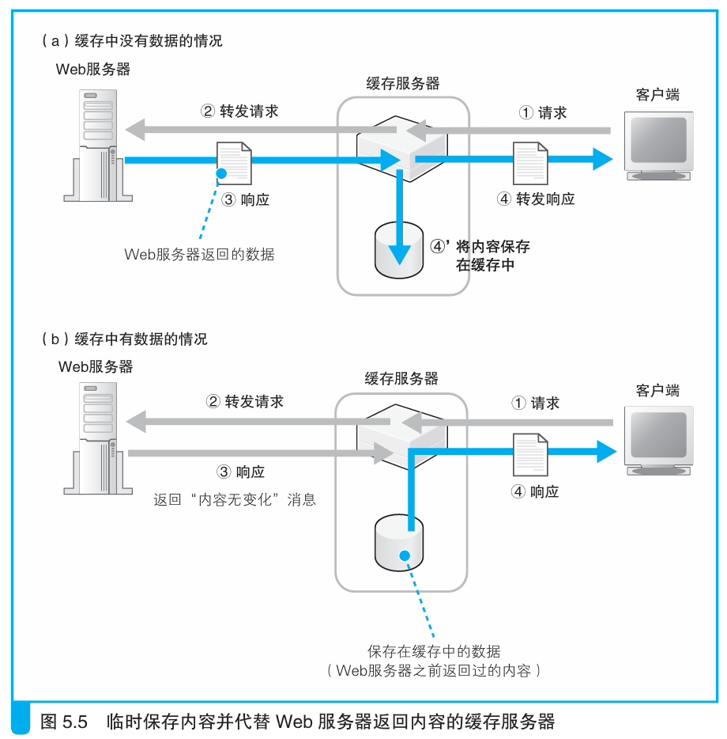
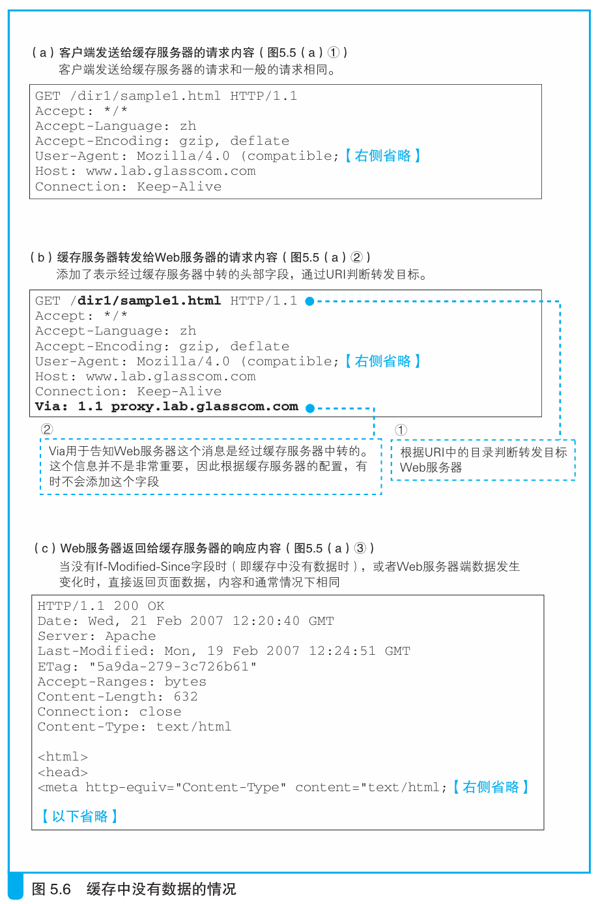
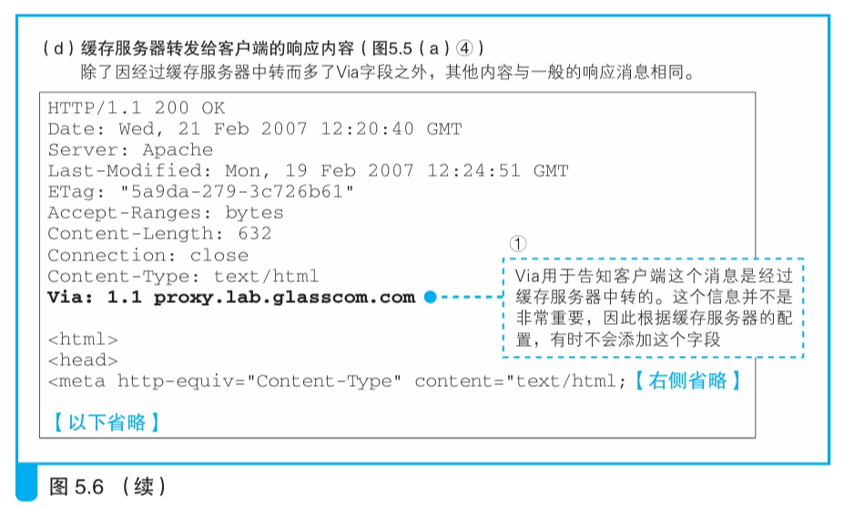

### 缓存服务器通过更新时间管理内容

> 本节介绍：缓存服务器转发响应消息前先询问Web服务器缓存内容是否有效，如果有效则直接转发缓存内容，否则转发Web服务器的返回消息。

缓存服务器的IP代替Web服务器IP被注册在DNS服务器中，客户端向缓存服务器发送请求消息，缓存服务器像Web服务器一样使用套接字接收，然后根据请求消息的内容确认是否有相应的缓存并做出后续操作。

---

###### 没有缓存的情况

缓存服务器发现缓存中没有客户端请求的数据时，会给网络包头部加上一个Via字段（图5.6b2），表示包经过缓存服务器转发，然后就把包发给Web服务器（图5.5a2）

如果只有一台Web服务器，那么直接把该服务器的IP地址和域名注册在缓存服务器上，缓存服务器直接将请求消息发给它。

如果有多台Web服务器，就需要判断应该把请求消息发给哪一台，最常用的方法是根据URI目录名（图5.6a1）来决定发给谁。

使用URI前需要进行如下设置：

> - 当URI为/dir1/ 这个目录时，转发给`www1.lab.glasscom.com`
>
> - 当URI为/dir2/ 这个目录时，转发给`www2.lab.glasscom.com`

根据上述规则，缓存服务器创建自己的套接字，连接Web服务器套接字，通过套接字把消息发送给对应的Web服务器。之后缓存服务器会在套接字中接收到Web服务器的响应消息（图5.5a3，图5.6c），就像一个真正的客户端一样。

缓存服务器收到响应消息后，会在响应消息头部加上Via字段表示该网络包经过缓存服务器转发（图5.6d），然后响应消息保存在缓存中并记录保存的时间（图5.5a4），同时该消息被缓存服务器以Web服务器的身份转发给客户端（图5.5a4）。

这就是代理的基本原理。

---

###### 命中缓存的情况

缓存服务器接收请求消息，然后在头部添加一个个`If Modified-Since`头部字段并将请求转发给Web服务器，询问Web服务器用户请求的数据是否已经发生变化（图5.5b，图5.7a）。

Web服务器比较页面数据的最后更新时间和`If Modified-Since`字段的值，如果在规定时间内页面数据没有变化，Web服务器就会返回一个表示没有变化的响应消息（图5.7b，图5.5b3）。这显然比Web服务器直接返回给客户端的响应包要小并且处理时间更短。

缓存服务器收到来自Web服务器的响应后就会给客户端发送缓存（图5.5b4），这一步发送的网络包和没有命中时是一样的（图5.6d）。