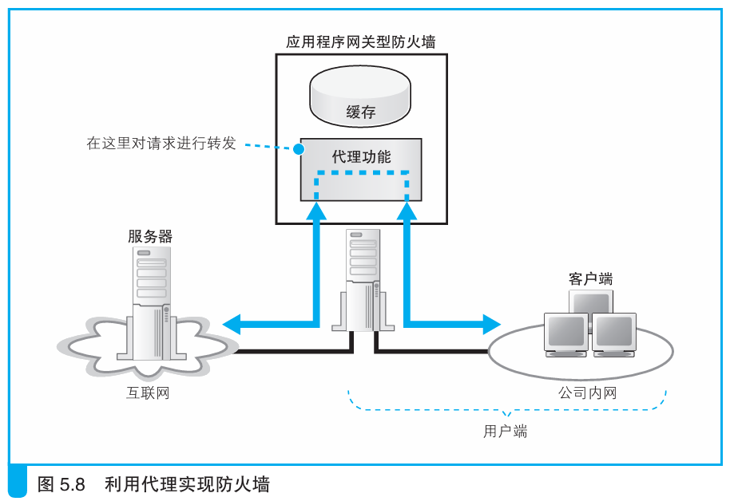
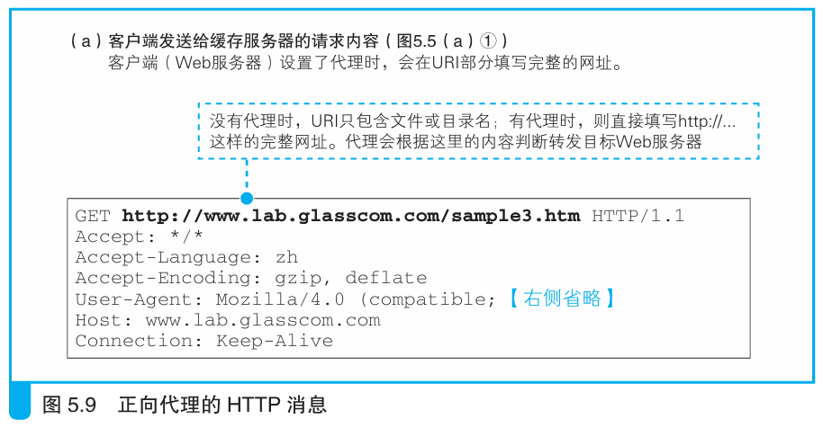

### 最原始的代理——正向代理

> 本节介绍：正向代理是将缓存服务器放在客户端一边，客户端的请求先发给缓存服务器，外来的消息也先到缓存服务器。缓存服务器可以用来缓存数据，也可以用来充当防火墙。

在客户端部署缓存服务器是最早的代理机制，称为正向代理。

> <i>其实正向代理并不是一开始就叫这个名字，最早说的“代理”指的就是我们现在说的正向代理，或者也叫“代理服务器”。这是因为最早只有这么一种代理，后来出现了各种其他方式的代理，为了相互区别才起了“××代理”这样的名字。此外，由于代理种类变多了，叫“××代理服务器”实在太长，一般都会省略“服务器”3个字。</i>

由于正向代理可以存储数据并且是互联网和内网之间的必经之路，所以缓存服务器除了用于缓存数据外，也用来充当防火墙。其原理大致如下图所示：

> <i>代理（Proxy）本来的意思并不是“转发”消息，而是先把消息收下来，然后“伪装”成原始客户端向Web服务器发出访问请求。</i>

由于代理相比一般包过滤的防火墙而言可以查看包的内容，因此可以监控公司内网向互联网发送的包从而决定要不要把包发出去。并且还可以将缓存内容作为响应消息发回内网而不需要再发给互联网中的服务器。

> <i>代理出现于ADSL、FTTH等技术实用化之前，那个时候还没有廉价高速的接入网，因此必须想办法榨干低速接入网中的所有能力。代理的缓存功能正是有效利用低速接入网的一种方法。</i>

在浏览器的设置窗口写入“代理服务器”的IP地址，客户端发包时就会直接发往代理服务器，并用目标Web服务器的网址作为URI。

