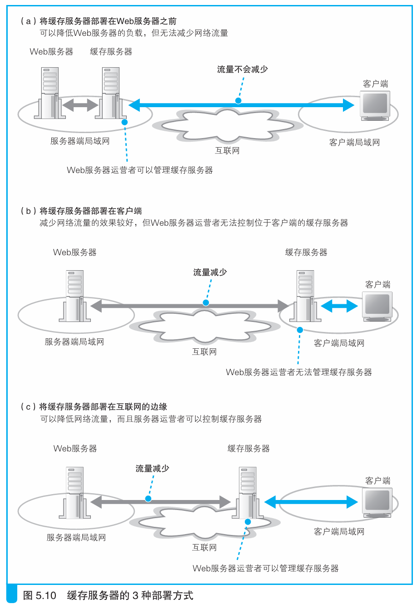

### 利用内容分发服务分担负载

> 本节介绍：内容分发服务商把缓存服务器部署在运营商的POP上，同时把这些服务器租借给Web服务商，这样Web服务商解决了大流量带来的问题，同时也不需要耗费精力维护这些缓存服务器。

部署在Web服务器端的缓存服务器可以减少Web服务器的负担（图5.10a），但不能减少流量。互联网中有一些网络拥塞点，网络包通过时要耗费一些时间，把缓存服务器部署在客户端（图5.10b），可以有效减少网络流量，提升网速。

但是客户端的缓存服务器归运营商所有，Web服务商不能控制，如果网页出现了很多大容量内容，服务商也不能对这些客户端的缓存服务器进行扩容。

内容分发服务可以解决上述两种方式的问题，负责内容分发服务的厂商，也就是CDSP（<i>Content Delivery Service Provider，内容分发服务运营商。</i>），与一些主要的运营商签约部署很多台缓存服务器，同时把这些缓存服务器租给Web服务商。那么客户端访问Web服务器，实际上就是在访问CDSP的缓存服务器了。

> <i>内容分发服务也叫CDS（Content Delivery Service）。（现在更常用的名称叫CDN（Content Delivery Network 或 Content Distribution Network）。——译者注）</i>

CDSP的缓存服务器可以缓存多个Web服务商的内容，这样就分摊了很多Web服务的缓存成本。